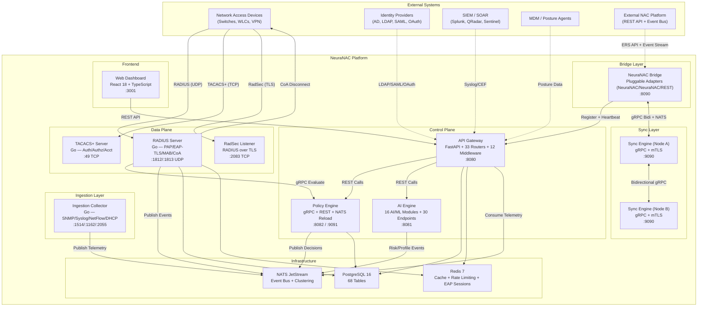

# NeuraNAC (NeuraNAC)

**The First AI-Aware Hybrid Network Access Control Platform**

> **GA Readiness: 100%** — All previously identified code gaps resolved. 8 microservices (incl. Ingestion Collector), 33 API routers, 12 middleware layers, 68-table PostgreSQL schema (6 migrations V001–V006 with upgrade/rollback tracking), 16 AI/ML modules, 640+ unit/component tests, 417 sanity tests, 80 E2E tests. Production-grade CI/CD (11 pipeline stages), Helm charts with HPA/PDB/NetworkPolicy, 4 deployment scenarios, multi-tenant SaaS with zero-trust mTLS, network telemetry ingestion (SNMP/Syslog/NetFlow/DHCP), DB-backed SIEM destinations, bridge mTLS enforcement, WebSocket in-band token refresh. See [docs/FULL_AUDIT_REPORT.md](docs/FULL_AUDIT_REPORT.md) for the comprehensive code audit.

---

## What is NeuraNAC?

NeuraNAC (NeuraNAC) is an enterprise-grade, AI-powered **Network Access Control (NAC)** platform built from the ground up to interoperate with or replace legacy and modern NAC products across vendors. It provides centralized authentication, authorization, and accounting (AAA) for wired, wireless, and VPN network access — while adding first-class support for AI/ML agent traffic governance, shadow AI detection, and automated threat response.

NeuraNAC is designed for organizations that need:

- **802.1X authentication** (RADIUS) for every endpoint connecting to the network
- **Device profiling** and posture assessment before granting access
- **Policy-driven segmentation** (VLAN, SGT/TrustSec) based on identity, device, posture, and risk
- **AI agent governance** — authenticate, authorize, and monitor AI/ML workloads as first-class network citizens
- **Hybrid deployment** — cloud-native or on-premises with NeuraNAC Bridge for bidirectional cross-site communication
- **Multi-tenant SaaS** — per-tenant isolation (row-level, schema, namespace), zero-trust mTLS, pluggable Bridge adapters

### What NeuraNAC Can Do

| Capability            | Description                                                                 |
| --------------------- | --------------------------------------------------------------------------- |
| RADIUS Authentication | PAP, EAP-TLS, EAP-TTLS, PEAP (RFC 5216 state machines)                      |
| TACACS+               | Device admin auth + authz (gRPC policy eval + circuit breaker) + accounting |
| MAB                   | Headless device auth via MAC address                                        |
| RadSec                | RADIUS over TLS (RFC 6614), configurable shared secret                      |
| CoA                   | Dynamic session termination / VLAN reassignment via UDP                     |
| Policy Engine         | 14 operators including AI-aware rules                                       |
| AI Agent Auth         | Register, authenticate, govern AI/ML agents                                 |
| Shadow AI Detection   | 14+ AI services detected via DNS/SNI/TLS                                    |
| Endpoint Profiling    | ONNX ML classification + ~500 OUI rule fallback                             |
| Risk Scoring          | Multi-dimensional risk with adaptive thresholds                             |
| Posture Assessment    | 8 check types (AV, firewall, encryption, patch, etc.)                       |
| Guest & BYOD          | Captive portals, sponsor groups, BYOD cert provisioning                     |
| Identity Sources      | AD, LDAP, SAML SSO, OAuth2, internal DB                                     |
| Certificate Mgmt      | X.509 CA, per-tenant ECDSA P-256, SPIFFE URIs                               |
| Segmentation          | SGT/TrustSec, adaptive policy matrix, VLAN assignment                       |
| Twin-Node Sync        | gRPC + mTLS + gzip, cursor pagination, hub-spoke                            |
| SIEM Integration      | Syslog + CEF to Splunk, QRadar, Sentinel                                    |
| Webhooks              | Event-driven notifications (SOAR, ticketing)                                |
| Privacy               | GDPR erasure + portability, CCPA subject rights                             |
| Anomaly Detection     | Baseline learning + deviation alerting (Redis)                              |
| NLP Policy            | Natural language → rules (45 intents + LLM)                                 |
| TLS Fingerprinting    | 16 JA3 + 3 JA4 known signatures                                             |
| Capacity Planning     | Linear regression + exponential smoothing                                   |
| Playbooks             | 6 built-in + custom automated responses                                     |
| Monitoring            | Prometheus `/metrics`, Grafana, 26 alert rules                              |
| **Legacy NAC Interoperability**   | **External NAC adapter support (REST/event sync) for coexistence/migration**            |
| **NeuraNAC Bridge**        | **Pluggable adapters: NeuraNAC, NeuraNAC-to-NeuraNAC (gRPC+NATS), REST**                   |
| **Multi-Tenant**      | **Row-level isolation, quota tiers, per-tenant mTLS**                       |

### Capability Metrics

| Metric                       | Value  | Details                                                                                                                                                             |
| ---------------------------- | ------ | ------------------------------------------------------------------------------------------------------------------------------------------------------------------- |
| **Microservices**            | 8      | API Gateway, AI Engine, Policy Engine, RADIUS Server, Sync Engine, NeuraNAC Bridge, Ingestion Collector, Web Dashboard                                                   |
| **REST API Endpoints**       | 333+   | 293 API Gateway (across 38 router files) + 40 AI Engine endpoints                                                                                                   |
| **API Routers**              | 33     | Including 6 NeuraNAC sub-routers for deep NeuraNAC integration                                                                                                                |
| **Middleware Layers**        | 12     | CORS, LogCorrelation, OTelTracing, SecurityHeaders, PrometheusMetrics, InputValidation, RateLimit, APIKey, Auth, BridgeTrust, Tenant, Federation                    |
| **AI/ML Modules**            | 16     | Profiling, Risk, Anomaly, NLP, RAG, Training, NL-to-SQL, Adaptive Risk, TLS Fingerprint, Capacity, Playbooks, Model Registry, Shadow AI, Drift, Chat Router, OUI DB |
| **AI Intents**               | 45     | Pattern-matched + LLM fallback via action router                                                                                                                    |
| **Policy Operators**         | 14     | equals, not_equals, contains, starts_with, ends_with, in, not_in, matches (regex), greater_than, less_than, between, is_true, is_false, exists                      |
| **Database Tables**          | 68     | Across 6 migrations (V001, V002, V003, V004, V005, V006)                                                                                                            |
| **Web UI Pages**             | 34     | Including 6 NeuraNAC pages, AI Mode, Topology (4 tabs), Site Management, On-prem Wizard                                                                                  |
| **Authentication Protocols** | 7      | PAP, EAP-TLS, EAP-TTLS, PEAP, MAB, CHAP, TACACS+                                                                                                                    |
| **Shadow AI Signatures**     | 14+    | OpenAI, Anthropic, Google AI, Hugging Face, Replicate, Cohere, Mistral, etc.                                                                                        |
| **TLS Fingerprints**         | 19     | 16 JA3 + 3 JA4 known signatures                                                                                                                                     |
| **OUI Database Entries**     | ~500   | Device vendor identification for MAC-based profiling                                                                                                                |
| **Posture Check Types**      | 8      | Antivirus, firewall, disk encryption, OS patch, screen lock, jailbreak, certificate, agent version                                                                  |
| **Built-in Playbooks**       | 6      | Quarantine, reauthenticate, notify, block, investigate, remediate + custom                                                                                          |
| **Identity Sources**         | 5      | Active Directory, LDAP, SAML SSO, OAuth2, Internal DB                                                                                                               |
| **Helm Templates**           | 11     | + 9 value overlays for 4 deployment scenarios                                                                                                                       |
| **Dockerfiles**              | 8      | All multi-stage, non-root, distroless (Go)                                                                                                                          |
| **CI/CD Pipeline Jobs**      | 11     | Lint, test, integration, E2E, load, Helm validation, security scan, build                                                                                           |
| **Alert Rules**              | 26     | RADIUS, API, Infrastructure, Services, Federation, NeuraNAC Bridge groups                                                                                                |
| **Makefile Targets**         | 33     | Build, test, lint, deploy, migrate (upgrade/rollback/status/validate), seed, proto-gen, etc.                                                                        |
| **Proto Definitions**        | 4      | policy.proto, sync.proto, ai.proto, bridge.proto                                                                                                                    |
| **Documentation Files**      | 27     | Architecture, deployment, operations, security, testing, guides                                                                                                     |
| **Total Test Cases**         | 1,269+ | 784 unit/component + 405 sanity + 80 E2E                                                                                                                            |
| **Sanity Test Phases**       | 15+    | API, DB setup, web routes, hybrid, AI, NeuraNAC, gaps, deployment scenarios                                                                                              |

### How NeuraNAC Compares to Competitors

NeuraNAC is built to extend or replace legacy NAC platforms. The table below highlights key architectural and capability differences.

| Capability           | **NeuraNAC**                      | **ClearPass**    | **Forescout**      | **FreeRADIUS**  |
| -------------------- | ---------------------------- | ---------------- | ------------------ | --------------- |
| **Architecture**     | 7 cloud-native microservices | VM/appliance     | VM/appliance       | C daemon        |
| **AI/ML**            | ✅ 16 modules                | ❌ Rule-based    | ⚠️ Limited        | ❌ None         |
| **AI Agent Gov.**    | ✅ Native                    | ❌               | ❌                 | ❌              |
| **Shadow AI**        | ✅ 14+ services              | ❌               | ❌                 | ❌              |
| **NLP Policies**     | ✅ 45 intents + LLM          | ❌ GUI only      | ❌ GUI only        | ❌ Config files |
| **REST API**         | ✅ 333+ endpoints            | ⚠️ Limited      | ⚠️ Subset         | ❌ None         |
| **Multi-Tenant**     | ✅ Row-level + mTLS          | ❌ Single        | ❌ Single          | ❌ Single       |
| **NeuraNAC Migration**    | ✅ 8-step wizard             | ❌ Manual        | ❌ Manual          | ❌ N/A          |
| **Multi-Site**       | ✅ Federation + gRPC         | ⚠️ Cluster      | ⚠️ Enterprise Mgr | ❌ Manual       |
| **EAP-TLS**          | ✅ `crypto/tls.Server`       | ✅ Full          | ❌ No RADIUS       | ✅ OpenSSL      |
| **EAP-TTLS/PAP**     | ✅                           | ✅               | ❌ No RADIUS       | ✅              |
| **MAB**              | ✅ + OUI (~500)              | ✅               | ✅ Agentless       | ⚠️ Basic       |
| **TACACS+**          | ✅ Auth + Authz + Acct       | ✅               | ❌                 | ❌              |
| **RadSec**           | ✅ TLS 1.3                   | ✅               | ❌ No RADIUS       | ✅              |
| **CoA**              | ✅ AI-triggered UDP          | ✅               | ⚠️ Integration    | ⚠️ Limited     |
| **On-Prem RADIUS**   | ✅ UDP 1812/1813             | ✅               | ❌ No RADIUS       | ✅              |
| **Identity Sources** | ✅ AD/LDAP/SAML/OAuth        | ✅ AD/LDAP/SAML  | ❌ N/A             | ⚠️ Files/SQL   |
| **NAD Support**      | ✅ Any vendor                | ✅ Any vendor    | ✅ Agentless       | ✅ Any          |
| **Self-Hosted**      | ✅ Docker/K8s/bare           | ✅ VM            | ✅ VM              | ✅ Any Linux    |
| **Segmentation**     | ✅ VLAN/SGT/matrix           | ✅ VLAN/roles    | ⚠️ Integration    | ⚠️ VLAN only   |
| **Tech Stack**       | Go + Python + React          | Java             | Proprietary        | C (1990s)       |
| **Container-Native** | ✅ Helm/HPA/PDB              | ⚠️ VM-first     | ⚠️ VM-first       | ⚠️ Packages    |
| **Data Sovereignty** | ✅ Deploy anywhere           | ✅ On-prem       | ✅ On-prem         | ✅ Full control |
| **CI/CD**            | ✅ 11-job Actions            | ❌ Proprietary   | ❌ Proprietary     | ⚠️ Community   |
| **Observability**    | ✅ Prom+Grafana+OTel         | ⚠️ Syslog/SNMP  | ⚠️ Dashboards     | ⚠️ Logs only   |
| **Playbooks**        | ✅ 6 built-in + custom       | ⚠️ Integrations | ✅ Built-in        | ❌ None         |
| **Privacy**          | ✅ GDPR + CCPA               | ⚠️ Manual       | ⚠️ Manual         | ❌ None         |
| **Deploy Time**      | ~5 min                       | Hours            | Hours             | Minutes         |
| **License**          | Open / subscription          | Per-endpoint     | Per-endpoint      | Free (GPLv2)    |

#### Key Differentiators

1. **AI-Native Architecture** — NeuraNAC is the only NAC platform with 16 built-in AI/ML modules. Shadow AI detection, NLP policy creation, adaptive risk scoring, and automated playbooks are native — not bolt-on integrations. Competitors require separate SOAR/SIEM tools to achieve partial parity.

2. **AI Agent Governance** — NeuraNAC treats AI/ML workloads as first-class network citizens with dedicated authentication, authorization, delegation scoping, and data flow monitoring. No competitor offers this capability.

3. **API-First with 333+ Endpoints** — Every NeuraNAC operation is exposed via REST API with OpenAPI documentation. Many legacy NAC APIs cover a far smaller subset of operations and are often read-heavy.

4. **Built-in NeuraNAC Migration** — NeuraNAC includes a zero-touch 8-step migration wizard, ERS entity sync, real-time event streaming, and AI-assisted policy translation. No competitor offers a built-in migration path from NeuraNAC.

5. **Cloud-Native Microservices** — While NeuraNAC, ClearPass, and Forescout are monolithic VM/appliance deployments, NeuraNAC runs as 7 independently scalable containers with Kubernetes-native autoscaling (HPA), pod disruption budgets, and network policies. Cisco Access Manager is cloud-native but Cisco-managed with no self-hosted option.

6. **Vendor-Agnostic NAD Support** — NeuraNAC works with any RADIUS-capable network device (Cisco, Aruba, Juniper, etc.). Cisco Access Manager is locked to Meraki switches and APs only — no third-party NAD support, no TACACS+, no RadSec, no on-prem RADIUS server.

7. **Multi-Tenant by Design** — NeuraNAC supports true SaaS multi-tenancy with row-level isolation, quota tiers, per-tenant mTLS certificates, and namespace isolation — enabling MSPs and large enterprises to serve multiple tenants from a single deployment. Access Manager is multi-tenant but fully Cisco-managed with no customer control over infrastructure or data residency.

8. **Data Sovereignty & Self-Hosting** — NeuraNAC can be deployed anywhere (on-prem, private cloud, air-gapped) with full data ownership. Cisco Access Manager stores all data in the Meraki cloud and is not available in Canada, mainland China, or India.

9. **Modern Developer Experience** — Go + Python + React + TypeScript stack with 1,269+ automated tests, 11-job CI/CD pipeline, Helm charts, and `docker compose up` for a 5-minute local setup. NeuraNAC requires days of appliance provisioning.

### What NeuraNAC Does NOT Do (Current Scope)

- **Wireless LAN Controller** — NeuraNAC is not a WLC; it authenticates endpoints connecting through WLCs
- **Firewall / IPS** — NeuraNAC enforces access policy, not inline packet inspection
- **SD-WAN Orchestration** — NeuraNAC provides identity context to SD-WAN but does not manage WAN fabric
- **MDM / UEM** — NeuraNAC checks posture data from MDM agents but is not an MDM solution itself
- **Physical access control** — NeuraNAC is network-only; no door/badge integration

---

## System Architecture



### Deployment Scenarios

| #   | Scenario                       | NeuraNAC? | Mode         | Helm Overlay(s)                                                        |
| --- | ------------------------------ | ---- | ------------ | ---------------------------------------------------------------------- |
| S1  | NeuraNAC + Hybrid (cloud + on-prem) | Yes  | `hybrid`     | `values-onprem-hybrid.yaml` + `values-cloud-hybrid.yaml`               |
| S2  | Cloud only (no NeuraNAC)            | No   | `standalone` | `values-cloud-standalone.yaml`                                         |
| S3  | On-prem only (no NeuraNAC)          | No   | `standalone` | `values-onprem-standalone.yaml`                                        |
| S4  | Hybrid no Legacy NAC                | No   | `hybrid`     | `values-hybrid-no-legacy-onprem.yaml` + `values-hybrid-no-legacy-cloud.yaml` |

See [docs/DEPLOYMENT.md](docs/DEPLOYMENT.md) for per-scenario Docker Compose and Helm install commands.

## Technology Stack

| Layer             | Component            | Technology                               | Purpose                                                                                                       |
| ----------------- | -------------------- | ---------------------------------------- | ------------------------------------------------------------------------------------------------------------- |
| **Data Plane**    | RADIUS Server        | Go 1.22+                                 | 802.1X authentication (PAP, EAP-TLS with `crypto/tls.Server`, EAP-TTLS, PEAP), MAB, accounting                |
| **Data Plane**    | TACACS+ Server       | Go 1.22+                                 | Device administration AAA with gRPC policy evaluation + circuit breaker                                       |
| **Data Plane**    | RadSec               | Go 1.22+                                 | RADIUS over TLS (RFC 6614), configurable shared secret                                                        |
| **Data Plane**    | CoA Sender           | Go 1.22+                                 | Dynamic session control (Disconnect-Request, Reauthenticate)                                                  |
| **Control Plane** | API Gateway          | Python 3.12 / FastAPI                    | 33 REST routers, 12 middleware layers, WebSocket events, NATS→DB telemetry consumer                           |
| **Control Plane** | Policy Engine        | Python 3.12 / gRPC                       | Condition-based policy evaluation (14 operators), NATS live reload, mTLS                                      |
| **Control Plane** | AI Engine            | Python 3.12 / ONNX Runtime               | 16 AI/ML modules, 30+ endpoints (profiling, risk, anomaly, NLP, RAG, playbooks, model registry)               |
| **Sync**          | Sync Engine          | Go 1.22+ / gRPC                          | Twin-node bidirectional replication, hub-spoke fan-out, mTLS (TLS 1.3), gzip, cursor pagination               |
| **Bridge**        | NeuraNAC Bridge           | Python 3.12 / FastAPI                    | Pluggable adapter architecture: NeuraNAC, NeuraNAC-to-NeuraNAC (gRPC bidi + NATS + mTLS), Generic REST                       |
| **Ingestion**     | Ingestion Collector  | Go 1.22+                                 | UDP listeners for SNMP traps (:1162), Syslog (:1514), NetFlow/IPFIX (:2055), DHCP — publishes to NATS         |
| **Frontend**      | Web Dashboard        | React 18, TypeScript, Vite, Tailwind CSS | 34 pages, AI chat mode, real-time monitoring, NeuraNAC 6-page suite                                                |
| **Database**      | PostgreSQL           | PostgreSQL 16                            | 68 tables across 6 migrations (V001–V006), multi-tenant row-level isolation, schema version tracking          |
| **Cache**         | Redis                | Redis 7                                  | Session cache, rate limiting, token bucket, AI baseline persistence                                           |
| **Messaging**     | NATS                 | NATS 2.10 (JetStream)                    | Event bus, pub/sub, clustering, leaf node federation                                                          |
| **Orchestration** | Kubernetes           | K8s 1.28+ / Helm 3.12+                   | 11 templates, 9 value overlays, production deployment                                                         |
| **Monitoring**    | Prometheus + Grafana | Prometheus 2.50 / Grafana 10.3           | Metrics, dashboards, alerting (26 rules), SLO/SLI definitions                                                 |
| **CI/CD**         | GitHub Actions       | Lint, Test, Scan, Build, Push            | 11-job pipeline, 70% coverage enforcement, SBOM generation                                                    |

---

## Quick Start

```bash
# 1. Clone and setup
git clone <repo-url> && cd NeuraNAC
cp .env.example .env            # Edit secrets as needed
./scripts/setup.sh              # Install dependencies + health checks

# 2. Start all services
cd deploy && docker compose up -d

# 3. Verify all services are healthy
curl http://localhost:8080/health   # API Gateway
curl http://localhost:8081/health   # AI Engine
curl http://localhost:8082/health   # Policy Engine
curl http://localhost:9100/health   # Sync Engine
curl http://localhost:8222/healthz  # NATS

# 4. Access the platform
#   Dashboard:  http://localhost:3001
#   API Docs:   http://localhost:8080/api/docs
#   RADIUS:     localhost:1812 (UDP) / localhost:1813 (UDP)
#   TACACS+:    localhost:49 (TCP)
#   RadSec:     localhost:2083 (TCP/TLS)
#   Grafana:    http://localhost:3000  (admin/admin)
```

> **Note:** The admin password is auto-generated at first boot. Check `docker logs neuranac-api` for the line:
> `Default admin credentials - username: admin, password: <generated>`

## Service Ports

| Service            | Port | Protocol | Description                             |
| ------------------ | ---- | -------- | --------------------------------------- |
| API Gateway        | 8080 | HTTP     | REST API (33 routers) + WebSocket       |
| Web Dashboard      | 3001 | HTTP     | React UI                                |
| RADIUS Auth        | 1812 | UDP      | 802.1X / MAB authentication             |
| RADIUS Acct        | 1813 | UDP      | Accounting (start/interim/stop)         |
| RadSec             | 2083 | TCP/TLS  | RADIUS over TLS                         |
| TACACS+            | 49   | TCP      | Device admin AAA                        |
| CoA                | 3799 | UDP      | Change of Authorization                 |
| Policy Engine API  | 8082 | HTTP     | Policy evaluation REST                  |
| Policy Engine gRPC | 9091 | gRPC     | Policy evaluation (internal)            |
| AI Engine          | 8081 | HTTP     | AI/ML modules                           |
| Sync Engine gRPC   | 9090 | gRPC     | Bidirectional replication               |
| Sync Engine Health | 9100 | HTTP     | Health + sync status                    |
| NeuraNAC Bridge         | 8090 | HTTP     | Pluggable adapter bridge (NeuraNAC/NeuraNAC/REST) |
| Ingestion Collector| 1514 | UDP      | Syslog receiver (also :1162 SNMP, :2055 NetFlow) |
| PostgreSQL         | 5432 | TCP      | Database                                |
| Redis              | 6379 | TCP      | Cache                                   |
| NATS               | 4222 | TCP      | Message bus                             |
| NATS Monitor       | 8222 | HTTP     | NATS health/metrics                     |
| Prometheus         | 9092 | HTTP     | Metrics collection                      |
| Grafana            | 3000 | HTTP     | Monitoring dashboards                   |

## API Endpoints (33 Routers)

| Prefix                            | Description                                                     | Methods                |
| --------------------------------- | --------------------------------------------------------------- | ---------------------- |
| `/health`                         | Service health check                                            | GET                    |
| `/api/v1/auth`                    | JWT login, token refresh, logout                                | POST                   |
| `/api/v1/setup`                   | First-time setup wizard                                         | GET, POST              |
| `/api/v1/policies`                | Policy sets, rules, auth profiles CRUD                          | GET, POST, PUT, DELETE |
| `/api/v1/network-devices`         | NAD management + auto-discovery                                 | GET, POST, PUT, DELETE |
| `/api/v1/endpoints`               | Endpoint inventory + AI profiling                               | GET, POST, PUT, DELETE |
| `/api/v1/sessions`                | RADIUS session monitoring                                       | GET                    |
| `/api/v1/identity-sources`        | AD/LDAP/SAML/OAuth connectors                                   | GET, POST, PUT, DELETE |
| `/api/v1/certificates`            | CA management, X.509 cert issuance, per-tenant ECDSA            | GET, POST, DELETE      |
| `/api/v1/segmentation`            | SGTs, adaptive policy matrix                                    | GET, POST, PUT, DELETE |
| `/api/v1/guest`                   | Guest portals, accounts, sponsors                               | GET, POST, PUT, DELETE |
| `/api/v1/posture`                 | Posture policies + assessment                                   | GET, POST, PUT         |
| `/api/v1/ai/agents`               | AI agent identity registry                                      | GET, POST, PUT, DELETE |
| `/api/v1/ai/data-flow`            | AI data flow policies + services                                | GET, POST, PUT, DELETE |
| `/api/v1/ai`                      | AI chat proxy, suggestions                                      | GET, POST              |
| `/api/v1/nodes`                   | Node registry, sync status, failover                            | GET, POST, DELETE      |
| `/api/v1/admin`                   | Admin users, roles, tenants                                     | GET, POST, PUT, DELETE |
| `/api/v1/licenses`                | License management                                              | GET, POST, PUT         |
| `/api/v1/audit`                   | Tamper-proof audit log + reports                                | GET                    |
| `/api/v1/diagnostics`             | Troubleshooting, connectivity tests, DB schema check            | GET, POST              |
| `/api/v1/privacy`                 | GDPR/CCPA subject rights, consent, exports                      | GET, POST, DELETE      |
| `/api/v1/siem`                    | SIEM forwarding configuration (DB-backed, persistent)           | GET, POST, PUT, DELETE |
| `/api/v1/webhooks`                | Webhook endpoint management                                     | GET, POST, PUT, DELETE |
| `/api/v1/legacy-nac` (base)       | Legacy NAC integration — connections, sync, entities                 | GET, POST, PUT, DELETE |
| `/api/v1/legacy-nac` (enhanced)   | Legacy NAC sub-routers: conflicts, migration, policies, events, sync | GET, POST, PUT, DELETE |
| `/api/v1/ws/events`               | Real-time WebSocket push (NATS → browser) + in-band token refresh | WebSocket              |
| `/api/v1/topology`                | Network topology views (physical, service mesh, data flow, NeuraNAC) | GET                    |
| `/api/v1/config/ui`               | UI configuration (deployment mode, site info)                   | GET                    |
| `/api/v1/sites`                   | Multi-site management (hybrid architecture)                     | GET, POST, PUT, DELETE |
| `/api/v1/connectors`              | Bridge connector registration + heartbeat                       | GET, POST, PUT, DELETE |
| `/api/v1/connectors` (activation) | Zero-trust connector activation with mTLS certs                 | POST                   |
| `/api/v1/tenants`                 | Tenant CRUD, quota management, node allocation                  | GET, POST, PUT, DELETE |

## AI Engine — 16 Modules, 30+ Endpoints

| Module                | Endpoint(s)                                                                                                      | Description                                                                  |
| --------------------- | ---------------------------------------------------------------------------------------------------------------- | ---------------------------------------------------------------------------- |
| Endpoint Profiler     | `POST /api/v1/profile`                                                                                           | ML-based device classification using ONNX Runtime + ~500 OUI rule fallback   |
| Risk Scorer           | `POST /api/v1/risk-score`                                                                                        | Multi-dimensional risk scoring (behavioral, identity, endpoint, AI activity) |
| Shadow AI Detector    | `POST /api/v1/shadow-ai/detect`                                                                                  | Detects 14+ unauthorized AI services via DNS/SNI/TLS                         |
| NLP Policy Assistant  | `POST /api/v1/nlp/translate`                                                                                     | Converts natural language to policy rules                                    |
| AI Troubleshooter     | `POST /api/v1/troubleshoot`                                                                                      | Root-cause analysis for authentication failures                              |
| Anomaly Detector      | `POST /api/v1/anomaly/analyze`                                                                                   | Baseline learning + deviation alerting (Redis persistence)                   |
| Policy Drift Detector | `POST /api/v1/drift/record`, `GET /analyze`                                                                      | Detects policy configuration drift over time                                 |
| Action Router         | `POST /api/v1/ai/chat`, `GET /capabilities`                                                                      | 45-intent NLP router with pattern matching + LLM fallback                    |
| RAG Troubleshooter    | `POST /api/v1/rag/troubleshoot`                                                                                  | Retrieval-augmented troubleshooting with 12 KB articles                      |
| Training Pipeline     | `POST /api/v1/training/sample`, `/train`, `GET /stats`                                                           | sklearn → ONNX export pipeline                                               |
| NL-to-SQL             | `POST /api/v1/nl-sql/query`                                                                                      | Natural language to SQL (18 templates + safety regex)                        |
| Adaptive Risk         | `POST /api/v1/risk/feedback`, `GET /thresholds`, `/adaptive-stats`                                               | Learns risk thresholds from operator feedback                                |
| TLS Fingerprinter     | `POST /api/v1/tls/analyze-ja3`, `/analyze-ja4`, `/compute-ja3`, `/custom-signature`, `GET /detections`, `/stats` | 16 JA3 + 3 JA4 known signatures                                              |
| Capacity Planner      | `POST /api/v1/capacity/record`, `GET /forecast`, `/metrics`                                                      | Linear regression + exponential smoothing forecasts                          |
| Playbook Engine       | `GET/POST /api/v1/playbooks`, `POST /{id}/execute`, `GET /executions/list`, `/stats/summary`                     | 6 built-in + custom automated response playbooks                             |
| Model Registry        | `POST /api/v1/models/register`, `/experiments`, `GET /models`, `/experiments`, `/stats`                          | A/B testing + weighted model selection                                       |

## Project Structure

```
NeuraNAC/
├── services/
│   ├── radius-server/        # Go — RADIUS (PAP/EAP-TLS/TTLS/PEAP/MAB) + TACACS+ + CoA + RadSec
│   │                         #   14 packages: handler, eaptls, eapstore, tacacs, radsec, coa,
│   │                         #   circuitbreaker, config, metrics, mschapv2, radius, store, tlsutil, pb
│   ├── sync-engine/          # Go — Twin-node replication, hub-spoke fan-out, mTLS (TLS 1.3),
│   │                         #   cursor pagination, gzip compression, keepalive
│   ├── ingestion-collector/  # Go — UDP listeners for SNMP/Syslog/NetFlow/DHCP,
│   │                         #   publishes telemetry to NATS JetStream
│   ├── api-gateway/          # Python FastAPI — 33 routers (incl. 6 NeuraNAC sub-routers),
│   │                         #   12 middleware layers, event stream consumer, WebSocket events,
│   │                         #   NATS→DB telemetry consumer
│   ├── policy-engine/        # Python — gRPC + REST evaluator (14 operators), NATS live reload, mTLS
│   ├── ai-engine/            # Python — 16 AI modules, 30+ endpoints, API key auth with rotation
│   └── neuranac-bridge/           # Python FastAPI — Pluggable adapters: NeuraNAC, NeuraNAC-to-NeuraNAC (gRPC bidi + mTLS), REST
├── web/                      # React 18 + TypeScript + Vite + Tailwind — 34 pages + AI chat mode
├── proto/                    # Protocol Buffers — policy.proto, ai.proto, sync.proto, bridge.proto
├── database/
│   ├── migrations/           # V001 + V002 + V003 + V004 + V005 + V006: 68 tables
│   │                         #   (multi-tenant, privacy, AI, NeuraNAC, hybrid, zero-trust, SaaS, SIEM)
│   └── seeds/                # Default tenant, test users/NADs, feature flags, AI signatures, quotas
├── deploy/
│   ├── docker-compose.yml    # Full local dev env (10 app containers + monitoring/tools profiles)
│   ├── docker-compose.hybrid.yml  # Hybrid multi-site overlay
│   ├── helm/                 # Helm charts: 11 templates, 9 value overlays (HPA, PDB, NetworkPolicy, Ingress)
│   ├── monitoring/           # Prometheus, alerting rules (26 alerts), Grafana dashboard, Loki, OTel, SLO/SLI
│   ├── postgres/             # PostgreSQL primary/standby replication configs
│   └── redis/                # Redis Sentinel HA configs
├── tests/
│   ├── integration/          # Go RADIUS protocol tests (12) + Python API/AI integration tests (38)
│   ├── e2e/                  # Playwright E2E — 10 spec files, 80 tests (login, nav, AI, NeuraNAC, admin, policy)
│   └── load/                 # k6 load tests with threshold enforcement (p95 < 500ms)
├── docs/                     # 27 documentation files (see Documentation section)
├── scripts/
│   ├── setup.sh              # One-command dev setup with health checks + auto-migration
│   ├── demo.sh               # Zero-install containerized demo runner (11 demos)
│   ├── sanity_runner.py      # 405 automated sanity tests (incl. 4 deployment scenarios)
│   ├── migrate.py            # DB migration runner (upgrade/rollback/status/validate) with checksum tracking
│   ├── rotate_secrets.sh     # JWT, DB, Redis, NATS secret rotation
│   ├── backup.sh / restore.sh  # PostgreSQL + Redis backup/restore with timestamped files
│   └── generate_proto.py     # Protocol buffer code generation
├── CHANGELOG.md              # Release notes for v1.0.0
├── CONTRIBUTING.md           # Contributor guide
├── .github/workflows/ci.yml  # 11-job CI: lint, test-go, test-python, test-web, integration,
│                              #   e2e (Playwright), load (k6), validate-helm, security-scan, build, SBOM
└── Makefile                  # 33 targets: build, test, lint, proto, docker, migrate (upgrade/rollback/status/validate), seed, etc.
```

## Testing

```bash
# Run all tests
make test

# Individual service tests
cd services/radius-server && go test ./... -v -race    # 127 tests across 15 test files
cd services/sync-engine && go test ./... -v             # 22 tests (config, service, main, mTLS peer dial)
cd services/ingestion-collector && go test ./... -v      # Go tests with NATS integration
cd services/api-gateway && pytest tests/ -v             # 270 tests across 13 test files
cd services/policy-engine && pytest tests/ -v           # 59 tests (engine, evaluator, gRPC server)
cd services/ai-engine && pytest tests/ -v               # 223 tests (all 16 AI modules)
cd services/neuranac-bridge && pytest tests/ -v              # 45 tests (adapters, connection manager, routers)

# Web dashboard tests
cd web && npx vitest run                                # 38 tests across 8 test files
cd web && npx tsc --noEmit && npx vite build            # TypeScript zero-error build

# Integration & E2E
cd tests/integration && go test -v -run TestRADIUS      # 12 RADIUS protocol tests
cd tests/integration && pytest -v                       # 38 Python integration tests
cd tests/e2e && npx playwright test                     # 80 tests across 10 spec files
k6 run tests/load/k6_api_gateway.js                     # Load test with p95 < 500ms threshold

# Sanity suite (405 tests — includes per-scenario S1–S4 validation)
python3 scripts/sanity_runner.py                        # Full API + web route + DB schema validation
```

**Total: 784+ unit/component tests + 80 E2E tests + 405 sanity tests = 1,269 total test cases.**

| Suite                | Framework       | Tests     | Coverage                                                                      |
| -------------------- | --------------- | --------- | ----------------------------------------------------------------------------- |
| radius-server        | `go test -race` | 127       | 70%+ enforced in CI (15 test files across 14 packages)                        |
| sync-engine          | `go test`       | 22        | 70%+ enforced in CI                                                           |
| ingestion-collector  | `go test -race` | —         | 70%+ enforced in CI (NATS publisher, UDP receivers)                           |
| api-gateway          | `pytest`        | 270       | 70%+ enforced in CI (13 test files)                                           |
| policy-engine        | `pytest`        | 59        | 70%+ enforced in CI                                                           |
| ai-engine            | `pytest`        | 223       | 70%+ enforced in CI (all 16 modules)                                          |
| neuranac-bridge           | `pytest`        | 45        | 70%+ enforced in CI (adapters, connection manager, routers)                   |
| web                  | `vitest`        | 38        | Components, pages, stores (8 test files)                                      |
| integration (Go)     | `go test`       | 12        | RADIUS protocol encoding, packet construction                                 |
| integration (Python) | `pytest`        | 38        | API, AI, cross-service flows                                                  |
| e2e                  | Playwright      | 80        | Login, navigation, AI mode, NeuraNAC pages, admin, policy, network (10 spec files) |
| load                 | k6              | Threshold | p95 < 500ms, error < 5%                                                       |
| sanity               | Custom runner   | 405       | Full API + DB schema + hybrid + 4 deployment scenarios                        |

See [docs/TESTING_REPORT.md](docs/TESTING_REPORT.md) and [docs/QUALITY_REPORT.md](docs/QUALITY_REPORT.md) for detailed results.

## Security Features

- **mTLS for gRPC** — Mutual TLS between RADIUS→Policy Engine and Sync Engine peer dial (TLS 1.3 minimum); enforced in production
- **EAP-TLS Production Hardening** — Rejects client certificates when no trusted CAs are configured in production (`Env=production`); non-production keeps lenient fallback for development
- **Bridge mTLS Enforcement** — `BRIDGE_TRUST_ENFORCE=true` requires valid per-tenant client certs for all adapter connections; blocks startup if certs are missing
- **Bridge Trust Middleware** — X-Client-Cert-Fingerprint verification for NeuraNAC Bridge connections; fail-open dev / fail-closed prod
- **Per-Tenant mTLS Certificates** — ECDSA P-256 client certs with SPIFFE URIs issued on zero-trust activation
- **AES-256-GCM Cache Encryption** — Secrets encrypted at rest in Redis with `CACHE_ENCRYPTION_KEY`
- **Non-Root Containers** — All 8 Dockerfiles use `USER nonroot:nonroot` (Go distroless) or `USER neuranac` (Python)
- **Distroless Base Images** — Go services use `gcr.io/distroless/static:nonroot` for minimal attack surface
- **12-Layer Middleware Stack** — CORS, LogCorrelation, OTelTracing, SecurityHeaders, PrometheusMetrics, InputValidation, RateLimit, APIKey, Auth, BridgeTrust, Tenant, Federation
- **OWASP Security Headers** — CSP, HSTS, X-Frame-Options, X-Content-Type-Options, Referrer-Policy
- **Input Validation Middleware** — SQL injection + XSS pattern detection on all requests
- **Rate Limiting** — Redis token bucket (100 req/min default, configurable per-tenant)
- **JWT Authentication** — Access + refresh tokens, role-based access control (RBAC), token revocation via Redis, in-band WebSocket token refresh with expiry monitoring
- **API Key Authentication** — AI Engine protected with rotating API keys (current + previous for zero-downtime rotation)
- **Tenant Isolation** — Row-level tenant filtering on all database queries; quota tiers (free/standard/enterprise/unlimited)
- **Tamper-Proof Audit Log** — Hash chain verification on all admin actions
- **bcrypt Password Hashing** — Salted hashing with configurable rounds
- **RadSec (RADIUS over TLS)** — Encrypted RADIUS transport (TLS 1.3), configurable shared secret via `RADSEC_SECRET` env var
- **Kubernetes NetworkPolicies** — Pod-to-pod traffic restriction (API, RADIUS, Policy, DB, NeuraNAC Bridge)
- **Federation HMAC Auth** — HMAC-SHA256 signed inter-site requests with 60s replay protection and circuit breaker (3 failures → 30s open)
- **Secret Rotation Script** — `scripts/rotate_secrets.sh` for JWT, DB, Redis, NATS credentials
- **CI Security Scanning** — Trivy (filesystem), TruffleHog (secrets), pip-audit (Python deps), SBOM generation per image
- **DB-Backed SIEM Destinations** — SIEM forwarding config persisted in PostgreSQL (not in-memory), survives restarts
- **Migration Rollback** — `scripts/migrate.py` with SHA-256 checksum validation, upgrade/rollback/status/validate commands, schema version tracking
- **Privacy Compliance** — GDPR Article 17 (erasure), Article 20 (portability), CCPA subject rights
- **Circuit Breaker** — Policy engine and TACACS+ authorization calls protected by circuit breaker with half-open recovery

See [docs/COMPLIANCE_CONTROLS.md](docs/COMPLIANCE_CONTROLS.md) for full security control mapping.

## CI/CD Pipeline

The GitHub Actions CI pipeline (`.github/workflows/ci.yml`) runs **11 jobs** on every push/PR:

| Job                      | What It Does                                                                                                                   |
| ------------------------ | ------------------------------------------------------------------------------------------------------------------------------ |
| **Lint**                 | `golangci-lint` (radius-server, sync-engine, ingestion-collector), `ruff check` (api-gateway, policy-engine, ai-engine, neuranac-bridge), `eslint` (web) |
| **Test Go Services**     | `go test -race` for radius-server, sync-engine, ingestion-collector with PostgreSQL, Redis, NATS; 70% coverage enforcement     |
| **Test Python Services** | `pytest --cov-fail-under=70` for api-gateway, policy-engine, ai-engine, neuranac-bridge                                             |
| **Test Web Dashboard**   | `vitest` component and page tests (Node 20)                                                                                    |
| **Integration Tests**    | Python cross-service API + AI integration tests (depends on test-python)                                                       |
| **Go Integration Tests** | RADIUS protocol encoding/packet tests (depends on test-go)                                                                     |
| **E2E Tests**            | Playwright browser tests (chromium) with failure artifact upload (depends on test-web)                                         |
| **Load Test**            | k6 smoke test (10s, 5 VUs) on main branch only (depends on test-python)                                                        |
| **Validate Helm**        | `helm lint` + `helm template` (default, onprem-hybrid, cloud-hybrid) + dry-run                                                 |
| **Security Scan**        | Trivy (filesystem), TruffleHog (verified secrets), pip-audit (3 Python deps files)                                             |
| **Build & Push**         | 8-service Docker matrix build → GHCR push, layer caching (GHA), SBOM generation per image                                      |

## Legacy NAC Interoperability

NeuraNAC supports full **coexistence and migration** from third-party NAC platforms:

| Feature                  | Description                                                                               |
| ------------------------ | ----------------------------------------------------------------------------------------- |
| **External API Client**  | Connect to external NAC platforms via supported adapters                                  |
| **Event Consumer**       | Real-time event streaming consumer with auto-reconnect                                    |
| **Full Sync**            | Pull policies, NADs, endpoints, and identity groups from external NAC platforms                                  |
| **Migration Wizard**     | Step-by-step zero-touch migration into NeuraNAC                                               |
| **Sync Conflicts**       | View and resolve bidirectional NeuraNAC ↔ external NAC conflicts                                        |
| **RADIUS Analysis**      | Snapshot and compare RADIUS traffic between systems                                   |
| **Policy Translation**   | AI-assisted policy translation into NeuraNAC format                                            |
| **Scheduled Sync**       | Automated recurring sync with configurable intervals                                      |
| **6 Dedicated UI Pages** | Legacy NAC Integration, Migration Wizard, Conflicts, RADIUS Analysis, Event Stream, Policy Translation |

See [docs/NeuraNAC_INTEGRATION.md](docs/NeuraNAC_INTEGRATION.md) for the full design doc.

## Infrastructure & Deployment

| Component                  | Details                                                                                                                                                                                         |
| -------------------------- | ----------------------------------------------------------------------------------------------------------------------------------------------------------------------------------------------- |
| **Helm Charts**            | 11 templates (api-gateway, ai-engine, neuranac-bridge, ingress, hpa, pdb, networkpolicy, policy-engine, radius-server, sync-engine, web) + 9 value overlays for 4 deployment scenarios               |
| **Autoscaling**            | HPA for API Gateway (2–10), RADIUS Server (2–8), AI Engine (1–4) with scale-up/down behaviors                                                                                                   |
| **Pod Disruption Budgets** | Ensures minimum availability during rolling updates                                                                                                                                             |
| **Network Policies**       | Restricts pod-to-pod traffic: RADIUS→Policy Engine (gRPC), API→DB, NeuraNAC Bridge egress to NeuraNAC ports                                                                                               |
| **Multi-Stage Docker**     | All 8 Dockerfiles use multi-stage builds; Go services use distroless base images                                                                                                                |
| **Docker Compose**         | 10 app containers (postgres, redis, nats, radius-server, api-gateway, policy-engine, ai-engine, sync-engine, neuranac-bridge, web) + 5 monitoring/tools (prometheus, grafana, exporters, demo-tools) |
| **Hybrid Overlay**         | `docker-compose.hybrid.yml` for multi-site deployments                                                                                                                                          |
| **PostgreSQL HA**          | Primary/standby replication configs (`deploy/postgres/`)                                                                                                                                        |
| **Redis HA**               | Sentinel configs (`deploy/redis/`)                                                                                                                                                              |
| **Backup/Restore**         | `scripts/backup.sh` + `scripts/restore.sh` for PostgreSQL (custom + plain SQL) + Redis (BGSAVE)                                                                                                 |
| **Schema Migrations**      | 6 SQL migration files (V001–V006) — 68 tables, applied via `scripts/migrate.py upgrade` with rollback + checksum validation                                                                     |
| **K8s Operator (Roadmap)** | CRD watchers for `NeuraNACCluster`, `NeuraNACSite`, `NeuraNACConnector` — planned for v1.1.0                                                                                                                   |

See [docs/DEPLOYMENT.md](docs/DEPLOYMENT.md) and [docs/CAPACITY_PLANNING.md](docs/CAPACITY_PLANNING.md) for production guidance.

## Observability

| Component                | Details                                                                                                                                 |
| ------------------------ | --------------------------------------------------------------------------------------------------------------------------------------- |
| **Prometheus**           | Scrape targets for all services + NATS exporter + PostgreSQL exporter (`deploy/monitoring/prometheus.yml`)                              |
| **Alerting Rules**       | 26 rules across multiple groups: RADIUS, API, Infrastructure, Services, Federation, NeuraNAC Bridge (`deploy/monitoring/alerting_rules.yml`) |
| **SLO/SLI Definitions**  | Service-level objectives with burn rate alerts (`deploy/monitoring/slo_sli.yml`)                                                        |
| **Grafana Dashboard**    | Pre-provisioned NeuraNAC dashboard with auth rate, latency, error panels (`deploy/monitoring/grafana-dashboard.json`)                        |
| **Loki Log Aggregation** | Centralized log collection via Promtail (`deploy/monitoring/loki-config.yml`, `promtail-config.yml`)                                    |
| **OpenTelemetry**        | OTel collector config + tracing middleware in API Gateway (`deploy/monitoring/otel-collector-config.yml`)                               |
| **Structured Logging**   | `zap` (Go), `structlog` (Python) — JSON format with consistent field names                                                              |
| **Log Correlation**      | `X-Request-ID` propagation across all services via LogCorrelationMiddleware                                                             |
| **Health Endpoints**     | All services expose `/health` with dependency status; API Gateway also exposes `/metrics` (Prometheus format)                           |

## Documentation (27 docs + README + CHANGELOG + CONTRIBUTING)

| Document                                                                         | Description                                                         |
| -------------------------------------------------------------------------------- | ------------------------------------------------------------------- |
| [README.md](README.md)                                                           | This file — product overview, quick start, architecture             |
| [CHANGELOG.md](CHANGELOG.md)                                                     | Release notes for v1.0.0                                            |
| [CONTRIBUTING.md](CONTRIBUTING.md)                                               | Contributor guide, PR process, coding standards                     |
| **Architecture & Design**                                                        |                                                                     |
| [docs/ARCHITECTURE.md](docs/ARCHITECTURE.md)                                     | System diagrams, data flow, integration patterns                    |
| [docs/ARCHITECTURE_SCALE_REPORT.md](docs/ARCHITECTURE_SCALE_REPORT.md)           | Scale estimates, data flow diagrams, env var inventory              |
| [docs/DEPLOYMENT_TOPOLOGY.md](docs/DEPLOYMENT_TOPOLOGY.md)                       | Deployment topology diagrams and scenarios                          |
| [docs/HYBRID_ARCHITECTURE_REPORT.md](docs/HYBRID_ARCHITECTURE_REPORT.md)         | Hybrid multi-site architecture design + implementation report       |
| [docs/MULTI_TENANT_ARCHITECTURE.md](docs/MULTI_TENANT_ARCHITECTURE.md)           | SaaS multi-tenant architecture (row-level isolation, quotas, mTLS)  |
| [docs/CAPACITY_PLANNING.md](docs/CAPACITY_PLANNING.md)                           | Scale estimates and resource planning                               |
| [docs/NETWORK_INGESTION_ARCHITECTURE.md](docs/NETWORK_INGESTION_ARCHITECTURE.md) | NAD→NeuraNAC data flow, ingestion collector design, scaling architecture |
| [docs/ROADMAP_TACACS_RADSEC.md](docs/ROADMAP_TACACS_RADSEC.md)                   | TACACS+ and RadSec implementation roadmap                           |
| **Quality & Readiness**                                                          |                                                                     |
| [docs/GA_READINESS_REPORT.md](docs/GA_READINESS_REPORT.md)                       | GA readiness assessment (100% — all gaps resolved)                  |
| [docs/FULL_AUDIT_REPORT.md](docs/FULL_AUDIT_REPORT.md)                           | Comprehensive code-only audit with gap fix verification             |
| [docs/CODE_BASED_AUDIT.md](docs/CODE_BASED_AUDIT.md)                             | Code-based audit analysis                                           |
| [docs/QUALITY_REPORT.md](docs/QUALITY_REPORT.md)                                 | Code quality analysis and metrics                                   |
| [docs/TESTING_REPORT.md](docs/TESTING_REPORT.md)                                 | Test results, scale & performance report                            |
| [docs/SANITY_REPORT.md](docs/SANITY_REPORT.md)                                   | Sanity test results (405 tests)                                     |
| [docs/SANITY_FIXES.md](docs/SANITY_FIXES.md)                                     | Sanity test fix log                                                 |
| [docs/GAPS_AND_RECOMMENDATIONS.md](docs/GAPS_AND_RECOMMENDATIONS.md)             | Identified gaps with remediation plan                               |
| [docs/PROJECT_ANALYSIS_REPORT.md](docs/PROJECT_ANALYSIS_REPORT.md)               | Full project analysis report                                        |
| **Operations & Security**                                                        |                                                                     |
| [docs/DEPLOYMENT.md](docs/DEPLOYMENT.md)                                         | Deployment guide, Helm, runbooks, env vars                          |
| [docs/RUNBOOK.md](docs/RUNBOOK.md)                                               | Operations runbook & troubleshooting guide (NOC/SRE)                |
| [docs/INCIDENT_RUNBOOK.md](docs/INCIDENT_RUNBOOK.md)                             | Incident response procedures                                        |
| [docs/COMPLIANCE_CONTROLS.md](docs/COMPLIANCE_CONTROLS.md)                       | Security control mapping                                            |
| [docs/INFRA_RESOURCE_REPORT.md](docs/INFRA_RESOURCE_REPORT.md)                   | Infrastructure resource analysis                                    |
| **Features & Integration**                                                       |                                                                     |
| [docs/NeuraNAC_INTEGRATION.md](docs/NeuraNAC_INTEGRATION.md)                               | NeuraNAC coexistence & migration design doc                              |
| [docs/AI_PHASES_REPORT.md](docs/AI_PHASES_REPORT.md)                             | All 4 AI development phases (25 items completed)                    |
| [docs/PHASES.md](docs/PHASES.md)                                                 | All 17 development phases from planning to production               |
| [docs/WORKFLOWS.md](docs/WORKFLOWS.md)                                           | NAD configuration E2E, supported devices, all workflows             |
| [docs/API_CHANGELOG.md](docs/API_CHANGELOG.md)                                   | API versioning and change history                                   |
| **Guides & References**                                                          |                                                                     |
| [docs/DEMO_GUIDE.md](docs/DEMO_GUIDE.md)                                         | **Complete demo guide — 50+ use cases with step-by-step scripts**   |
| [docs/WIKI.md](docs/WIKI.md)                                                     | **Complete technical wiki — single-page architect reference**       |

## Supported Use Cases (50+)

> For complete demo scripts with copy-paste `curl` commands for every use case, see **[docs/DEMO_GUIDE.md](docs/DEMO_GUIDE.md)**.

### RADIUS Authentication (9 use cases)

| Use Case           | Protocol        | Description                                    |
| ------------------ | --------------- | ---------------------------------------------- |
| PAP Authentication | RADIUS UDP 1812 | Username/password authentication               |
| EAP-TLS (802.1X)   | RADIUS UDP 1812 | Certificate-based mutual authentication        |
| EAP-TTLS           | RADIUS UDP 1812 | Tunneled TLS with inner PAP/CHAP               |
| PEAP/MSCHAPv2      | RADIUS UDP 1812 | Protected EAP with MSCHAPv2                    |
| MAB                | RADIUS UDP 1812 | MAC Authentication Bypass for headless devices |
| Accounting         | RADIUS UDP 1813 | Session start/interim/stop tracking            |
| RadSec             | TLS TCP 2083    | RADIUS over TLS (RFC 6614)                     |
| CoA                | RADIUS UDP 3799 | Dynamic session re-auth / VLAN reassignment    |
| TACACS+            | TCP 49          | Device administration AAA                      |

### Policy Engine (5 use cases)

| Use Case                 | Description                                             |
| ------------------------ | ------------------------------------------------------- |
| VLAN Assignment          | Assign VLAN based on identity, group, device type       |
| SGT Assignment           | TrustSec Security Group Tag via cisco-av-pair           |
| AI-augmented Policies    | Risk score and anomaly conditions in policy rules       |
| Circuit Breaker Fallback | Auto-fallback to DB-based eval if policy engine is down |
| NLP Policy Creation      | Natural language → policy rules via AI chat             |

### AI Engine (15 use cases)

| Use Case               | Description                                                |
| ---------------------- | ---------------------------------------------------------- |
| AI Chat (45 intents)   | Natural language queries and actions                       |
| Endpoint Profiling     | ONNX-based device type classification                      |
| Risk Scoring           | Behavioral + identity + endpoint risk assessment           |
| Shadow AI Detection    | Detect unauthorized AI/LLM traffic (DNS/SNI/TLS)           |
| NLP Policy Translation | English text → policy conditions                           |
| Anomaly Detection      | Time-of-day / behavioral baseline deviations               |
| Policy Drift Detection | Expected vs actual authorization tracking                  |
| RAG Troubleshooter     | 12 KB articles for guided troubleshooting                  |
| NL-to-SQL              | Natural language → SQL query with safety regex             |
| Adaptive Risk          | Learns risk thresholds from operator feedback              |
| TLS Fingerprinting     | JA3/JA4 signature analysis                                 |
| Capacity Planning      | Forecasting with linear regression + exponential smoothing |
| Automated Playbooks    | 6 built-in + custom playbook execution                     |
| Model Registry         | A/B testing + weighted model selection                     |
| Training Pipeline      | sklearn → ONNX model export                                |

### Legacy NAC Interoperability (11 use cases)

| Use Case                 | Description                                                    |
| ------------------------ | -------------------------------------------------------------- |
| External NAC Connection | Connect to third-party NAC with adapter-based version compatibility             |
| Full Entity Sync         | Pull NADs, users, endpoints, and policy objects from external NAC                     |
| Bidirectional Sync       | Push NeuraNAC changes back to external NAC (coexistence mode)                |
| Sync Scheduler           | Automated background sync with configurable intervals          |
| Real-time Events  | Event bus/WebSocket subscription to session and policy events |
| Sync Conflict Resolution | Detect and resolve NeuraNAC ↔ external NAC data conflicts                    |
| AI Policy Translation    | Translate external NAC authorization policies to NeuraNAC format             |
| RADIUS Traffic Analysis  | Snapshot and compare RADIUS traffic across NAC platforms               |
| Zero-Touch Migration     | 8-step wizard: preflight → cutover with rollback               |
| Multi-Site Dashboard      | Manage multiple NeuraNAC deployments from one pane                  |
| Event Stream Simulation  | Inject test events for development                             |

### Web Dashboard (34 pages) & Observability

| Use Case                  | Description                                                                             |
| ------------------------- | --------------------------------------------------------------------------------------- |
| Dashboard Overview        | Health cards, metrics, quick stats                                                      |
| **Network Topology**      | **4-tab interactive visualization: Physical, Service Mesh, Data Flow, Legacy NAC Interop** |
| Network Device Management | NAD CRUD, auto-detection, vendor support                                                |
| Session Monitoring        | Live RADIUS session table                                                               |
| Endpoint Inventory        | Profiled device inventory                                                               |
| Policy Management         | Rule-based policy CRUD                                                                  |
| Certificate Management    | CA + X.509 certificate lifecycle                                                        |
| TrustSec Segmentation     | SGT management                                                                          |
| Guest Portal              | Guest access configuration                                                              |
| AI Mode (ChatGPT-like)    | Full-screen NLP interface                                                               |
| Prometheus + Grafana      | Pre-provisioned monitoring dashboards                                                   |
| Site Management           | Multi-site configuration + connector status                                             |
| Sanity Test Suite         | 405 automated tests across all services                                                 |

---

## How to Demo in Your Local Environment

This section describes how to run a full **end-to-end demo** on your local laptop, including connecting to an external NAC platform and generating simulated RADIUS traffic from a virtual NAD. For the complete guide with `curl` commands for every use case, see **[docs/DEMO_GUIDE.md](docs/DEMO_GUIDE.md)**.

### Zero-Install Demo (Recommended)

The only prerequisite is **Docker Desktop** (8 GB RAM). All client-side tools (radtest, Go RADIUS generator, k6, Python sanity runner, curl, jq) are containerized — nothing to install on your Mac.

```bash
# One command — sets up everything + opens interactive demo menu
./scripts/demo.sh

# Or step by step:
./scripts/demo.sh --setup              # Start NeuraNAC stack + build demo-tools container
./scripts/demo.sh --run                # Interactive demo menu (11 demos)
./scripts/demo.sh --run pap            # Quick RADIUS PAP test
./scripts/demo.sh --run full           # Run all demos in sequence
./scripts/demo.sh --run sanity         # Run 405 sanity tests
./scripts/demo.sh --shell              # Shell with all tools (radtest, go, k6, jq...)
./scripts/demo.sh --monitoring         # Include Prometheus + Grafana
./scripts/demo.sh --status             # Check container & service health
./scripts/demo.sh --stop               # Tear down everything
```

**Interactive demo menu** (inside the containerized runner):

| #   | Demo            | What It Does                                      |
| --- | --------------- | ------------------------------------------------- |
| 1   | Health Check    | All services + DB schema + topology health matrix |
| 2   | RADIUS PAP      | Single `radtest` Access-Request                   |
| 3   | RADIUS Bulk     | 20 PAP requests for dashboard activity            |
| 4   | Go RADIUS Suite | PAP, MAB, EAP, Accounting (Go tests)              |
| 5   | k6 Load Test    | API stress test (30s, 5 VUs)                      |
| 6   | Topology Views  | All 4 topology tabs via API                       |
| 7   | AI Chat         | Natural language queries                          |
| 8   | Legacy NAC Integration | Create connection, sync, event stream                   |
| 9   | RadSec TLS      | Verify RadSec listener                            |
| 10  | Sanity Suite    | Run all 405 tests                                 |
| 11  | Full Demo       | Run all demos in sequence                         |

### End-to-End Demo Topology

The diagram below shows every component running on your laptop during a demo, including all ports, protocols, and data flows. The **Topology View** page (`/topology`) in the Web Dashboard visualizes this exact architecture interactively. The diagram reflects the **hybrid multi-site architecture** with federation, NeuraNAC Bridge, and Sync Engine.

```
┌──────────────────────────────────────────────────────────────────────────────────────┐
│  YOUR LAPTOP (macOS / Linux)                                                         │
│                                                                                      │
│  ╔════════════════════════════════════════════════════════════════════════════════╗   │
│  ║  ENDPOINTS / SIMULATED NADs                                                   ║   │
│  ║  ┌───────────────┐  ┌──────────────┐  ┌──────────────┐                        ║   │
│  ║  │  radtest /    │  │  Go RADIUS   │  │  k6 Load     │                        ║   │
│  ║  │  FreeRADIUS   │  │  Generator   │  │  Test Runner │                        ║   │
│  ║  │  CLI          │  │  (PAP/MAB/   │  │  (API stress)│                        ║   │
│  ║  └───────┬───────┘  │  EAP/Acct)   │  └──────┬───────┘                        ║   │
│  ║          │          └──────┬───────┘          │                                ║   │
│  ╚══════════╪═════════════════╪══════════════════╪════════════════════════════════╝   │
│             │ RADIUS UDP      │ RADIUS UDP       │ HTTP REST                          │
│             │ 1812/1813       │ 1812/1813/2083   │ :8080                              │
│             ▼                 ▼                   ▼                                    │
│  ╔════════════════════════════════════════════════════════════════════════════════╗   │
│  ║  NeuraNAC PLATFORM (Docker Compose)     [site_id: 00000000-...-000000000001]       ║   │
│  ║  Deployment Mode: standalone | hybrid    Site Type: onprem | cloud            ║   │
│  ║                                                                               ║   │
│  ║  ┌─────────────────┐  gRPC :8082  ┌──────────────────┐                       ║   │
│  ║  │  RADIUS Server  │─────────────►│  Policy Engine   │                       ║   │
│  ║  │  Go :1812/1813  │              │  Python :8082    │                       ║   │
│  ║  │  RadSec :2083   │◄─────────────│  (VLAN/SGT/ACL) │                       ║   │
│  ║  │  TACACS+ :49    │  Decision    │  site_id-aware   │                       ║   │
│  ║  │  CoA :3799      │              └──────────────────┘                       ║   │
│  ║  │  site_id-aware  │                                                         ║   │
│  ║  └────────┬────────┘  HTTP :8081  ┌──────────────────┐                       ║   │
│  ║           │──────────────────────►│  AI Engine       │                       ║   │
│  ║           │  Inline profiling     │  Python :8081    │                       ║   │
│  ║           │  + risk scoring       │  (16 AI modules) │                       ║   │
│  ║           │                       │  NLP Chat Router │                       ║   │
│  ║           │                       └──────────────────┘                       ║   │
│  ║           │ NATS events                                                      ║   │
│  ║           ▼                                                                  ║   │
│  ║  ┌─────────────────┐  REST :8080  ┌──────────────────┐                       ║   │
│  ║  │  API Gateway    │◄────────────►│  Web Dashboard   │                       ║   │
│  ║  │  Python :8080   │             │  React :3001     │                       ║   │
│  ║  │  (33 routers)   │             │  (34 pages)      │                       ║   │
│  ║  │  12 middleware   │             │                  │                       ║   │
│  ║  │  JWT + RBAC     │             │  Pages include:  │                       ║   │
│  ║  │  Federation MW  │             │  • Dashboard     │                       ║   │
│  ║  │  (HMAC-SHA256   │             │  • Topology      │─ 4-tab view          ║   │
│  ║  │   cross-site)   │─ ─ ─ ─ ─ ─►│  • Sessions     │  Physical             ║   │
│  ║  │  /api/v1/sites  │  aggregated  │  • Policies     │  Service Mesh         ║   │
│  ║  │  /api/v1/       │  component   │  • NeuraNAC (6 sub)  │  Data Flow            ║   │
│  ║  │   connectors    │  health +    │  • AI Mode      │  NeuraNAC Integration      ║   │
│  ║  │                 │  status data │  • Site Mgmt    │  (NeuraNACGuard-wrapped)   ║   │
│  ║  └───┬─────────┬───┘             └──────────────────┘                       ║   │
│  ║      │         │                                                             ║   │
│  ║      │         │ HTTP :8090                                                  ║   │
│  ║      │         ▼                                                             ║   │
│  ║      │  ┌──────────────────┐                                                 ║   │
│  ║      │  │  NeuraNAC Bridge      │─── Pluggable adapter bridge                     ║   │
│  ║      │  │  Python :8090    │    NeuraNAC / NeuraNAC-to-NeuraNAC / REST                      ║   │
│  ║      │  │  (always active) │    Registration + WS tunnel                     ║   │
│  ║      │  └──────────────────┘                                                 ║   │
│  ║      │                                                                       ║   │
│  ║      │ gRPC :9090                                                            ║   │
│  ║      ▼                                                                       ║   │
│  ║  ┌──────────────────┐                                                        ║   │
│  ║  │  Sync Engine     │─── Twin-node / hub-spoke replication                   ║   │
│  ║  │  Go :9090        │    gRPC + gzip + mTLS                                  ║   │
│  ║  │  Health :9100    │    Cursor-based resync                                 ║   │
│  ║  └──────────────────┘    (Active in hybrid mode)                             ║   │
│  ║                                                                               ║   │
│  ║  ┌───────────────────────────────────────────────────────────────────┐        ║   │
│  ║  │  INFRASTRUCTURE                                                   │        ║   │
│  ║  │  ┌────────────┐  ┌────────────┐  ┌────────────┐                  │        ║   │
│  ║  │  │ PostgreSQL │  │   Redis    │  │   NATS     │                  │        ║   │
│  ║  │  │ :5432      │  │   :6379    │  │   :4222    │                  │        ║   │
│  ║  │  │ (68 tables)│  │   (cache)  │  │ (JetStream)│                  │        ║   │
│  ║  │  └────────────┘  └────────────┘  └────────────┘                  │        ║   │
│  ║  └───────────────────────────────────────────────────────────────────┘        ║   │
│  ║                                                                               ║   │
│  ║  ┌───────────────────────────────────────────────────────────────────┐        ║   │
│  ║  │  OBSERVABILITY                                                    │        ║   │
│  ║  │  ┌────────────┐  ┌────────────┐                                   │        ║   │
│  ║  │  │ Prometheus │  │  Grafana   │  26 alert rules                   │        ║   │
│  ║  │  │ :9092      │  │  :3000     │  (incl. federation alerts)        │        ║   │
│  ║  │  └────────────┘  └────────────┘                                   │        ║   │
│  ║  └───────────────────────────────────────────────────────────────────┘        ║   │
│  ╚═══════════════╤═════════════════════════════╤════════════════════════╝        │
│                  │                              │                                 │
│    ┌─────────────┘                              └──────────────┐                 │
│    │ Federation (hybrid mode)                                  │                 │
│    │ HMAC-SHA256 signed                    ERS API :9060       │                 │
│    │ X-NeuraNAC-Site: local|peer|all            Event Stream :8910  │                 │
│    │ NEURANAC_PEER_API_URL                      Bidirectional Sync  │                 │
│    ▼                                                           ▼                 │
└────┼───────────────────────────────────────────────────────────┼─────────────────┘
     │                                                           │
     ▼                                                           ▼
┌─────────────────────────┐                       ┌────────────────────────┐
│  NeuraNAC Peer Site          │                       │  External NAC Platform      │
│  (cloud or 2nd on-prem) │                       │  x.x.x.x:443          │
│  site_id: ...000002     │                       │  ERS API :9060         │
│                         │                       │  Event Stream :8910   │
│  Mirrors this stack:    │                       │                        │
│  • API Gateway :8080    │                       │  Entities synced:      │
│  • RADIUS :1812         │                       │  • Network Devices     │
│  • Policy Engine :8082  │                       │  • Endpoints           │
│  • Sync Engine :9090    │                       │  • Policies            │
│  • PostgreSQL + Redis   │                       │  • SGTs                │
│  + NATS Leaf            │                       └────────────────────────┘
└─────────────────────────┘
  (Only present in hybrid mode — S1, S4)
```

> **Deployment scenarios determine which components are active.** In standalone mode (S2, S3), the federation middleware and Sync Engine cross-site replication are inactive. NeuraNAC Bridge is always active (pluggable adapters). In hybrid mode (S1, S4), the peer site and federation are enabled. The NeuraNAC adapter within NeuraNAC Bridge activates when `NeuraNAC_ENABLED=true` (S1). See [docs/DEPLOYMENT.md](docs/DEPLOYMENT.md) for details.

### RADIUS Authentication Data Flow (9 Steps)

This is the exact flow visualized in the **Topology → Data Flow** tab:

```
  ┌──────────┐    802.1X/MAB     ┌──────────┐    RADIUS UDP    ┌──────────────┐
  │ Endpoint │ ─────────────────►│   NAD    │ ──────────────► │ RADIUS Server│
  │ (suppl.) │                   │ (switch) │    :1812         │ Go :1812     │
  └──────────┘                   └──────────┘                  └──────┬───────┘
                                                                      │
                    ┌─────────────────────────────────────────────────┤
                    │                                                 │
                    ▼                                                 ▼
            ┌──────────────┐                               ┌──────────────┐
            │ AI Engine    │  HTTP :8081                    │Policy Engine │
            │ (Profile +   │◄──────────────────────────────│ gRPC :8082   │
            │  Risk Score) │                               │ (Evaluate)   │
            └──────┬───────┘                               └──────┬───────┘
                   │ risk_score, anomaly_flag                     │ VLAN, SGT
                   ▼                                              ▼
            ┌──────────────┐    RADIUS Response          ┌──────────────┐
            │ PostgreSQL   │◄────────────────────────────│ RADIUS Server│
            │ (session log)│                             │ (build reply)│
            └──────────────┘                             └──────┬───────┘
                                                                │
                                          Accept/Reject/        │  CoA :3799
                                          Challenge             │  (if high risk)
                                                                ▼
                                                         ┌──────────────┐
                                                         │   NAD        │
                                                         │ (apply VLAN) │
                                                         └──────────────┘
```

### Prerequisites

- **Docker Desktop** — at least 8 GB RAM allocated
- **Go 1.22+** — for the RADIUS traffic generator
- *(Optional)* `radtest` from FreeRADIUS — `brew install freeradius-server`
- *(Optional)* External NAC platform accessible from your laptop (VPN/LAN) with API/event access enabled

### Step 1 — Start the NeuraNAC Stack

```bash
# One-command setup: starts infra, runs migrations, seeds DB, builds & starts all services
./scripts/setup.sh

# Or manually:
cp .env.example .env
docker compose -f deploy/docker-compose.yml up -d --build

# Run all migrations and seed data (68 tables across 6 migration files)
# Option A: Use the migration runner (recommended — tracks versions + checksums)
python scripts/migrate.py upgrade

# Option B: Manual SQL application
docker compose -f deploy/docker-compose.yml exec -T postgres psql -U neuranac -d neuranac < database/migrations/V001_initial_schema.sql
docker compose -f deploy/docker-compose.yml exec -T postgres psql -U neuranac -d neuranac < database/migrations/V002_legacy_nac_enhancements.sql
docker compose -f deploy/docker-compose.yml exec -T postgres psql -U neuranac -d neuranac < database/migrations/V003_siem_and_operational.sql
docker compose -f deploy/docker-compose.yml exec -T postgres psql -U neuranac -d neuranac < database/migrations/V004_hybrid_architecture.sql
docker compose -f deploy/docker-compose.yml exec -T postgres psql -U neuranac -d neuranac < database/migrations/V005_zero_trust_activation.sql
docker compose -f deploy/docker-compose.yml exec -T postgres psql -U neuranac -d neuranac < database/migrations/V006_multi_tenant_saas.sql
docker compose -f deploy/docker-compose.yml exec -T postgres psql -U neuranac -d neuranac < database/seeds/seed_data.sql

# Migration management
python scripts/migrate.py status      # Show applied/pending migrations
python scripts/migrate.py validate    # Verify checksums of applied migrations
python scripts/migrate.py rollback    # Rollback last applied migration
```

To include monitoring (Prometheus + Grafana):

```bash
docker compose -f deploy/docker-compose.yml --profile monitoring up -d
```

Verify all services are healthy:

```bash
curl http://localhost:8080/health   # API Gateway
curl http://localhost:9100/health   # RADIUS Server
curl http://localhost:8082/health   # Policy Engine
curl http://localhost:8081/health   # AI Engine
```

### Step 2 — Register a Simulated NAD (Your Laptop as a Virtual Switch)

The seed data already registers two NADs for local testing:

| NAD Name         | IP           | Shared Secret |
| ---------------- | ------------ | ------------- |
| `localhost-test` | `127.0.0.1`  | `testing123`  |
| `docker-host`    | `172.17.0.1` | `testing123`  |

To add your laptop's actual LAN IP (e.g., for host-network traffic):

```bash
# Replace 192.168.1.100 with your IP (run: ifconfig en0 | grep inet)
docker compose -f deploy/docker-compose.yml exec -T postgres psql -U neuranac -d neuranac -c "
INSERT INTO network_devices (tenant_id, name, ip_address, device_type, vendor, model, shared_secret_encrypted, status)
SELECT t.id, 'my-laptop', '192.168.1.100', 'virtual', 'Demo', 'laptop-nad', 'testing123', 'active'
FROM tenants t WHERE t.slug = 'default'
ON CONFLICT DO NOTHING;
"
```

### Step 3 — Generate RADIUS Traffic (Simulated NAD)

**Option A: `radtest` (simplest — one command)**

```bash
# PAP authentication
radtest testuser testing123 127.0.0.1 0 testing123
# Expected response: Access-Accept or Access-Reject
```

**Option B: Go RADIUS Generator (richer — PAP, MAB, EAP, Accounting)**

The project includes a full RADIUS protocol test suite at `tests/integration/radius_protocol_test.go`:

```bash
# Run all live RADIUS tests against local NeuraNAC
cd tests/integration
go test -v -run "TestRADIUS_Live" -timeout 30s
```

This sends PAP Access-Requests, MAB requests, Accounting Start/Stop, and EAP Identity packets.

**Option C: Bulk Traffic Loop (for visible dashboard activity)**

```bash
cd tests/integration
for i in $(seq 1 20); do
  go test -v -run "TestRADIUS_LiveAccessRequest" -timeout 5s 2>&1 | tail -3
  go test -v -run "TestRADIUS_LiveMABRequest" -timeout 5s 2>&1 | tail -3
  go test -v -run "TestRADIUS_LiveAccountingRequest" -timeout 5s 2>&1 | tail -3
  sleep 0.5
done
```

**Option D: k6 API Load Test (for API traffic and dashboard metrics)**

```bash
k6 run --duration 60s --vus 5 tests/load/k6_api_gateway.js
```

### Step 4 — Connect to an External NAC Platform

Open the NeuraNAC dashboard at **http://localhost:3001** and navigate to **Legacy NAC > Integration**, or use the API:

```bash
# Create external NAC connection
curl -X POST http://localhost:8080/api/v1/connectors/register \
  -H "Content-Type: application/json" \
  -d '{
    "name": "Lab NeuraNAC",
    "hostname": "x.x.x.x",
    "port": 443,
    "username": "ersadmin",
    "password": "YourNeuraNACPassword",
    "ers_enabled": true,
    "ers_port": 9060,
    "event_stream_enabled": false,
    "verify_ssl": false,
    "deployment_mode": "coexistence"
  }'

# Test the connection
curl http://localhost:8080/api/v1/connectors/{id}/test

# Trigger full sync (pull policies, NADs, endpoints from external NAC into NeuraNAC)
curl -X POST http://localhost:8080/api/v1/connectors/{id}/sync \
  -H "Content-Type: application/json" \
  -d '{"entity_types": ["all"], "sync_type": "full"}'
```

**External NAC Prerequisites:**
- API access must be enabled on the source NAC platform
- The integration user must have read/write sync privileges
- Source NAC must be reachable from your laptop (VPN/LAN)

### Step 5 — Demo Walkthrough Script

| Scene                     | What to Show                    | How                                                                                   |
| ------------------------- | ------------------------------- | ------------------------------------------------------------------------------------- |
| **1. Dashboard**          | Health overview, metric cards   | Open http://localhost:3001                                                            |
| **2. Legacy NAC Coexistence**    | Connect to external NAC, test, sync      | Legacy NAC > Integration > Create Connection > Test > Sync                         |
| **3. Live RADIUS Auth**   | PAP + MAB authentication        | Run `radtest testuser testing123 127.0.0.1 0 testing123` then check Sessions page     |
| **4. Endpoint Profiling** | MAB device appears in inventory | Run Go MAB test, check Endpoints page                                                 |
| **5. AI Features**        | AI chat, risk scoring           | Toggle AI Mode (top-right pill), ask *"Show me all sessions"*                         |
| **6. Policy Engine**      | Policy evaluation flow          | View Policies page, trigger RADIUS auth, see VLAN/SGT assignment                      |
| **7. Monitoring**         | Live RADIUS metrics             | Open Grafana http://localhost:3000 (admin/changeme_grafana_admin), view NeuraNAC dashboard |
| **8. NAC Migration**      | Zero-touch migration wizard     | Legacy NAC > Migration Wizard                                                          |

### Seed Credentials

| Username   | Password     | Purpose                |
| ---------- | ------------ | ---------------------- |
| `testuser` | `testing123` | RADIUS PAP test user   |
| `admin`    | `admin123`   | RADIUS admin test user |

NAD shared secret for all test NADs: **`testing123`**

### Quick Reference — All Demo URLs

| Service           | URL                            |
| ----------------- | ------------------------------ |
| Web Dashboard     | http://localhost:3001          |
| API Swagger Docs  | http://localhost:8080/api/docs |
| RADIUS Auth       | `localhost:1812/udp`           |
| RADIUS Accounting | `localhost:1813/udp`           |
| RadSec (TLS)      | `localhost:2083/tcp`           |
| TACACS+           | `localhost:49/tcp`             |
| CoA               | `localhost:3799/udp`           |
| Prometheus        | http://localhost:9092          |
| Grafana           | http://localhost:3000          |
| NATS Monitor      | http://localhost:8222          |

### Troubleshooting

| Issue                    | Fix                                                                                                                                  |
| ------------------------ | ------------------------------------------------------------------------------------------------------------------------------------ |
| RADIUS no response       | Check `docker logs neuranac-radius` — verify NAD IP is registered in `network_devices` table                                              |
| Legacy NAC connection refused   | Ensure API/event endpoints are enabled on source NAC, check firewall/VPN connectivity                                                                        |
| Port 1812 already in use | Stop local FreeRADIUS: `sudo launchctl unload /Library/LaunchDaemons/*radius*`                                                       |
| Port 49 requires root    | macOS restricts ports < 1024. Remap in docker-compose: change `"49:49"` to `"10049:49"`                                              |
| DB seed fails            | Verify: `docker compose -f deploy/docker-compose.yml exec -T postgres psql -U neuranac -d neuranac -c "SELECT count(*) FROM network_devices;"` |
| Services unhealthy       | Check logs: `docker compose -f deploy/docker-compose.yml logs --tail=50 <service-name>`                                              |

---

## Production Environment — End-to-End Topology

The diagram below shows the NeuraNAC platform deployed in a production network with real network access devices (switches, APs, WLCs), physical endpoints, HA infrastructure, **hybrid multi-site federation**, and optional external NAC coexistence. This is the target architecture that the demo environment simulates. In hybrid mode (S1, S4), a second site (cloud or on-prem) is federated via HMAC-SHA256 signed API calls and Sync Engine replication.

```
┌─────────────────────────────────────────────────────────────────────────────────────┐
│  CAMPUS / BRANCH NETWORK                                                            │
│                                                                                     │
│  ┌─────────────┐   ┌─────────────┐  ┌─────────────┐  ┌─────────────┐                │
│  │  Corporate   │  │  BYOD       │  │  IoT / OT   │  │  Guest      │                │
│  │  Laptop      │  │  Phone      │  │  Sensor     │  │  Device     │                │
│  │  (802.1X)    │  │  (802.1X)   │  │  (MAB)      │  │  (Web Auth) │                │
│  └──────┬───────┘  └──────┬──────┘  └──────┬──────┘  └──────┬──────┘                │
│         │ EAP-TLS         │ PEAP           │ MAB             │ Guest Portal          │
│         └────────┬────────┴────────────────┴────────┬────────┘                       │
│                  ▼                                   ▼                                │
│  ┌────────────────────────┐          ┌────────────────────────┐                      │
│  │  Access Switch         │          │  Wireless LAN          │                      │
│  │  Cisco C9300 / C9200   │          │  Controller (WLC)      │                      │
│  │  ┌──────────────────┐  │          │  Cisco 9800 / Meraki   │                      │
│  │  │ RADIUS Client    │  │          │  ┌──────────────────┐  │                      │
│  │  │ NAS-IP: 10.1.x.x │  │          │  │ RADIUS Client    │  │                      │
│  │  │ Shared Secret ****│  │         │  │ NAS-IP: 10.2.x.x │  │                      │
│  │  └──────────────────┘  │          │  └──────────────────┘  │                      │
│  └───────────┬────────────┘          └───────────┬────────────┘                      │
│              │ RADIUS :1812/1813                  │ RADIUS :1812/1813                 │
│              │ RadSec :2083 (optional)            │ RadSec :2083 (optional)           │
│              │ CoA :3799                          │ CoA :3799                         │
└──────────────┼────────────────────────────────────┼──────────────────────────────────┘
               │                                    │
               ▼                                    ▼
┌──────────────────────────────────────────────────────────────────────────────────────┐
│  NeuraNAC DATA CENTER (Kubernetes / VM / Bare-metal)                                       │
│                                                                                       │
│  ┌─── Twin-Node A (Active) ────────────────────────────────────────────────────────┐ │
│  │  [site_id: 00000000-...-000000000001]  [site_type: onprem]                      │ │
│  │                                                                                  │ │
│  │  ┌─────────────────┐   gRPC    ┌──────────────────┐   HTTP    ┌──────────────┐  │ │
│  │  │  RADIUS Server  │──────────►│  Policy Engine   │─────────►│  AI Engine   │  │ │
│  │  │  :1812/1813     │           │  :8082           │          │  :8081       │  │ │
│  │  │  RadSec :2083   │◄──────────│  VLAN/SGT/ACL/   │◄─────────│  16 modules  │  │ │
│  │  │  TACACS+ :49    │  Decision │  dACL assignment │  Risk +   │  Profiling   │  │ │
│  │  │  CoA :3799      │           │  site_id-aware   │  Anomaly  │  Risk Score  │  │ │
│  │  │  site_id-aware  │           └──────────────────┘           │  Shadow AI   │  │ │
│  │  └────────┬────────┘                                          │  JA3/JA4     │  │ │
│  │           │                                                   └──────────────┘  │ │
│  │           │ NATS events                                                          │ │
│  │           ▼                                                                      │ │
│  │  ┌─────────────────┐   REST    ┌──────────────────┐                              │ │
│  │  │  API Gateway    │◄─────────►│  Web Dashboard   │                              │ │
│  │  │  :8080          │           │  :443 (nginx)    │                              │ │
│  │  │  33 routers     │           │  34 pages        │                              │ │
│  │  │  12 middleware   │           │  Topology View   │                              │ │
│  │  │  mTLS + JWT     │           │  AI Mode         │                              │ │
│  │  │  Federation MW  │           │  Site Management │                              │ │
│  │  │  (HMAC-SHA256)  │           └──────────────────┘                              │ │
│  │  └───┬──────┬──────┘                                                             │ │
│  │      │      │                                                                    │ │
│  │      │      │ HTTP :8090 (always active)                                         │ │
│  │      │      ▼                                                                    │ │
│  │      │  ┌──────────────────┐                                                     │ │
│  │      │  │  NeuraNAC Bridge      │─── Pluggable adapter bridge (NeuraNAC/NeuraNAC/REST)          │ │
│  │      │  │  :8090           │    Always active on every site                      │ │
│  │      │  └──────────────────┘                                                     │ │
│  │           │                                                                      │ │
│  │  ┌────────┴──────────────────────────────────────────────────────────────────┐   │ │
│  │  │  INFRASTRUCTURE (HA)                                                      │   │ │
│  │  │  ┌──────────────┐  ┌──────────────┐  ┌──────────────┐                    │   │ │
│  │  │  │ PostgreSQL   │  │  Redis       │  │  NATS        │                    │   │ │
│  │  │  │ Primary      │  │  Sentinel    │  │  3-node      │                    │   │ │
│  │  │  │ :5432        │  │  :6379       │  │  JetStream   │                    │   │ │
│  │  │  │ (68 tables)  │  │  (session    │  │  Cluster     │                    │   │ │
│  │  │  │              │  │   cache)     │  │  :4222       │                    │   │ │
│  │  │  └──────┬───────┘  └──────────────┘  └──────┬───────┘                    │   │ │
│  │  │         │ Replication                        │ Leaf Nodes                 │   │ │
│  │  └─────────┼────────────────────────────────────┼───────────────────────────┘   │ │
│  └────────────┼────────────────────────────────────┼───────────────────────────────┘ │
│               │                                    │                                  │
│  ┌────────────┼────────────────────────────────────┼───────────────────────────────┐ │
│  │  Twin-Node B (Standby)                          │                                │ │
│  │           ▼                                     ▼                                │ │
│  │  ┌──────────────┐     Sync Engine      ┌──────────────┐                          │ │
│  │  │ PostgreSQL   │◄────────────────────►│  NATS Leaf   │                          │ │
│  │  │ Replica      │  gRPC + gzip + mTLS  │  Node        │                          │ │
│  │  └──────────────┘  cursor-based resync └──────────────┘                          │ │
│  │  + Full RADIUS/API/AI service stack (hot standby)                                │ │
│  └──────────────────────────────────────────────────────────────────────────────────┘ │
│                                                                                       │
│  ┌─── Observability ───────────────────────────────────────────────────────────────┐ │
│  │  ┌──────────────┐  ┌──────────────┐  ┌──────────────┐  ┌──────────────┐        │ │
│  │  │ Prometheus   │  │  Grafana     │  │  SIEM        │  │  Syslog /    │        │ │
│  │  │ (metrics)    │  │  (dashboards)│  │  (Splunk /   │  │  Webhook     │        │ │
│  │  │ 26 alerts    │  │              │  │   Sentinel)  │  │  Forwarding  │        │ │
│  │  │ (incl. fed.) │  │              │  │              │  │              │        │ │
│  │  └──────────────┘  └──────────────┘  └──────────────┘  └──────────────┘        │ │
│  └─────────────────────────────────────────────────────────────────────────────────┘ │
│                                                                                       │
└──────┬────────────────────────────────────┬──────────────────────────┬────────────────┘
       │                                    │                          │
       │ Federation (hybrid: S1, S4)        │ NeuraNAC Bridge               │
       │ HMAC-SHA256 signed                 │ ERS API :9060            │
       │ X-NeuraNAC-Site: local|peer|all         │ Event Stream :8910       │
       │ NEURANAC_PEER_API_URL                   │ Bidirectional Sync       │
       ▼                                    │                          ▼
┌─────────────────────────────────┐         │  ┌───────────────────────────────────────────┐
│  NeuraNAC PEER SITE (Cloud / 2nd DC) │         │  │ CISCO NeuraNAC CLUSTER (Coexistence / Migration)│
│  [site_id: ...000002]           │         │  │                                            │
│  [site_type: cloud]             │         │  │  ┌──────────────┐  ┌──────────────┐        │
│                                 │         │  │  │  NeuraNAC PAN     │  │  NeuraNAC PSN-1/2 │        │
│  Mirrors primary site stack:    │         │  │  │  (Admin+MnT) │  │  RADIUS :1812│        │
│  • API Gateway :8080            │         │  │  │  ERS :9060   │  │  :1813,:2083 │        │
│  • RADIUS Server :1812         │         │  │  │  Event:8910   │  │              │        │
│  • Policy Engine :8082         │         │  │  └──────────────┘  └──────────────┘        │
│  • AI Engine :8081             │         │  │                                            │
│  • Sync Engine :9090           │         │  │  Entities synced:                           │
│  • NeuraNAC Bridge :8090            │         │  │    Network Devices, Endpoints, Policies,    │
│  • PostgreSQL + Redis + NATS   │         │  │    SGTs, TrustSec Matrix, Certificates      │
│  + NATS Leaf → Hub cluster     │         │  │                                            │
│                                 │◄────────┘  │  Migration path:                           │
│  Cross-site replication via     │            │    NeuraNAC → coexistence → NeuraNAC primary →       │
│  Sync Engine (gRPC+gzip+mTLS)  │            │    NeuraNAC decommission                        │
│                                 │            │                                            │
│  (Only in hybrid: S1, S4)      │            │  (NeuraNAC adapter active when NeuraNAC_ENABLED=true)  │
└─────────────────────────────────┘            └────────────────────────────────────────────┘
```

> **Deployment scenarios control the production topology.** S2 (cloud standalone) and S3 (on-prem standalone) do not include the peer site or NeuraNAC cluster. S1 includes both. S4 includes the peer site but not NeuraNAC. See [docs/DEPLOYMENT.md](docs/DEPLOYMENT.md).

### Supported Network Access Devices (NADs)

| Device Category              | Supported Models                      | Protocols                    | Notes                              |
| ---------------------------- | ------------------------------------- | ---------------------------- | ---------------------------------- |
| **Campus Switches**          | Cisco Catalyst 9300, 9200, 3850, 3650 | RADIUS, RadSec, TACACS+, CoA | 802.1X, MAB, Web Auth              |
| **Wireless LAN Controllers** | Cisco 9800, 3504; Meraki MR           | RADIUS, CoA                  | WPA2/3-Enterprise, FlexConnect     |
| **Branch Routers**           | Cisco ISR 4000, Catalyst 8000         | RADIUS, TACACS+              | Site-to-site + AAA                 |
| **SD-WAN Edge**              | Cisco vEdge, Catalyst SD-WAN          | RADIUS                       | Identity-aware routing             |
| **VPN Concentrators**        | Cisco ASA, FTD, AnyConnect            | RADIUS, TACACS+              | Remote access VPN AAA              |
| **Third-party NADs**         | Aruba, Juniper, HPE, Arista           | RADIUS (standard)            | Any RFC 2865/3579-compliant device |
| **IoT/OT Gateways**          | Industrial switches, Meraki MT        | MAB                          | Profiling via AI Engine            |
| **Virtual / Cloud**          | AWS, Azure, GCP gateway appliances    | RADIUS                       | Cloud-hosted workloads             |

### Production RADIUS Authentication Data Flow

In production, real endpoints (laptops, phones, IoT sensors) authenticate through physical NADs. The 9-step flow is identical to the demo, but with real hardware in the path. In **hybrid mode (S1, S4)**, sessions are tagged with `site_id` and federation allows cross-site policy queries via `X-NeuraNAC-Site` headers.

```
                           Campus / Branch Network
 ┌──────────┐                                         ┌──────────────────────────────┐
 │ Employee  │  ── 802.1X EAP-TLS ──►  ┌──────────┐  │  NeuraNAC Data Center             │
 │ Laptop    │                          │ Catalyst │  │  [site_id: ...000001]        │
 └──────────┘                          │ 9300     │  │  [site_type: onprem]         │
                                        │ (NAD)    │──┼─►┌────────────────┐          │
 ┌──────────┐                          │          │  │  │ RADIUS Server  │          │
 │ BYOD     │  ── 802.1X PEAP ────────►│          │  │  │ :1812 (UDP)    │          │
 │ Phone    │                          └──────────┘  │  │ :2083 (RadSec) │          │
 └──────────┘                                        │  │ site_id-aware  │          │
                                                     │  └───────┬────────┘          │
 ┌──────────┐                          ┌──────────┐  │    ┌─────┴─────┐              │
 │ IoT      │  ── MAB ────────────────►│ Meraki   │──┼─►  ▼           ▼              │
 │ Sensor   │                          │ AP (NAD) │  │  ┌──────┐ ┌──────┐           │
 └──────────┘                          └──────────┘  │  │Policy│ │  AI  │           │
                                                     │  │Engine│ │Engine│           │
 ┌──────────┐                          ┌──────────┐  │  │:8082 │ │:8081 │           │
 │ Guest    │  ── Web Auth ───────────►│ WLC 9800 │──┼─►│VLAN/ │ │Prof/ │           │
 │ User     │                          │ (NAD)    │  │  │SGT   │ │Risk  │           │
 └──────────┘                          └──────────┘  │  │site- │ │Score │           │
                                                     │  │aware │ │      │           │
 ┌──────────┐                          ┌──────────┐  │  └──┬───┘ └──┬───┘           │
 │ Remote   │  ── VPN (AnyConnect) ───►│ ASA/FTD  │──┼─►   │        │               │
 │ Worker   │                          │ (NAD)    │  │     ▼        ▼               │
 └──────────┘                          └──────────┘  │  ┌────────────────┐          │
                                                     │  │ RADIUS Server  │          │
                                                     │  │ builds reply:  │          │
                                                     │  │ • Accept/Reject│          │
                                                     │  │ • VLAN + SGT   │          │
                                                     │  │ • dACL         │          │
                                                     │  │ • CoA if risky │          │
                                                     │  └───────┬────────┘          │
                                                     │          │                    │
                                                     │          ▼                    │
                                                     │  ┌────────────────┐           │
                                                     │  │ PostgreSQL     │           │
                                                     │  │ (68 tables)    │           │
                                                     │  │ session log +  │           │
                                                     │  │ audit trail    │           │
                                                     │  └────────────────┘           │
                                                     │          │                    │
                                                     │          │ (hybrid mode)      │
                                                     │          ▼                    │
                                                     │  ┌────────────────┐           │
                                                     │  │ Sync Engine    │           │
                                                     │  │ gRPC+gzip+mTLS│──► Peer   │
                                                     │  │ replicates to  │   Site    │
                                                     │  │ peer site      │           │
                                                     │  └────────────────┘           │
                                                     └──────────────────────────────┘
                                                               │
                                            CoA :3799          │
                                            (quarantine /      │
                                             re-auth)          │
                                                               ▼
                                                     NADs apply enforcement:
                                                     • VLAN assignment
                                                     • SGT tagging
                                                     • dACL (downloadable ACL)
                                                     • Port bounce / reauthenticate
```

### Key Differences: Demo vs. Production

| Aspect               | Demo (Local)                       | Production                                                       |
| -------------------- | ---------------------------------- | ---------------------------------------------------------------- |
| **Endpoints**        | `radtest`, Go generator, k6        | Real laptops, phones, IoT sensors                                |
| **NADs**             | Simulated (localhost, Docker)      | Cisco Catalyst 9300/9200, WLC 9800, Meraki, ASA                  |
| **RADIUS transport** | UDP loopback                       | UDP/RadSec over campus network, VPN                              |
| **Authentication**   | PAP (simulated)                    | EAP-TLS, PEAP, EAP-TTLS, MAB, Web Auth                           |
| **Infrastructure**   | Single Docker Compose host         | Twin-node HA, PostgreSQL replication, NATS cluster               |
| **TLS**              | Self-signed dev certs              | Production CA-signed certificates, mTLS                          |
| **NeuraNAC**              | Simulated or lab NeuraNAC               | NeuraNAC cluster (PAN + PSNs) with ERS + event stream                 |
| **Monitoring**       | Optional Prometheus + Grafana      | Prometheus + Grafana + SIEM + syslog forwarding (26 alert rules) |
| **Scale**            | 1-50 test sessions                 | 10,000+ concurrent sessions per node                             |
| **Deployment mode**  | `standalone` (default)             | `standalone` or `hybrid` (multi-site federation)                 |
| **Federation**       | Disabled (no peer)                 | HMAC-SHA256 signed cross-site API, Sync Engine replication       |
| **Site identity**    | Single `site_id`                   | Per-site `NEURANAC_SITE_ID` + `NEURANAC_SITE_TYPE` (onprem/cloud)          |
| **NeuraNAC Bridge**       | Always active (pluggable adapters) | NeuraNAC, NeuraNAC-to-NeuraNAC, or Generic REST adapter per site                |
| **Secrets**          | `.env` file defaults               | Kubernetes Secrets, `FEDERATION_SHARED_SECRET` ≥32 chars         |

---

## License

Proprietary — All rights reserved.
