# NeuraNAC Architecture & Design

This document provides a comprehensive technical view of the NeuraNAC (NeuraNAC) architecture, including system topology, data flow patterns, integration points, and internal component design.

---

## Table of Contents

1. [High-Level System Architecture](#1-high-level-system-architecture)
2. [Component Architecture](#2-component-architecture)
3. [Data Flow Diagrams](#3-data-flow-diagrams)
4. [Integration Architecture](#4-integration-architecture)
5. [Database Schema Design](#5-database-schema-design)
6. [Security Architecture](#6-security-architecture)
7. [Deployment Architecture](#7-deployment-architecture)
8. [Network Topology](#8-network-topology)
9. [Legacy NAC Integration Architecture](#9-legacy-nac-integration-architecture)

---

## 1. High-Level System Architecture

NeuraNAC follows a **microservices architecture** with clear separation between the data plane (RADIUS/TACACS+), control plane (API/Policy/AI), synchronization layer, and presentation layer.

```mermaid
graph TB
    subgraph Clients["Client Layer"]
        BROWSER["Admin Browser<br/>React Dashboard :3001"]
        RESTCLI["REST API Clients<br/>Automation / Scripts"]
        SUPPLICANT["802.1X Supplicants<br/>Endpoints / Devices"]
        NETADMIN["Network Admins<br/>SSH / Console"]
    end

    subgraph Edge["Network Edge"]
        SWITCH["Switches<br/>(Cisco, Aruba, Juniper)"]
        WLC["Wireless Controllers<br/>(Cisco WLC, Aruba)"]
        VPN["VPN Concentrators<br/>(ASA, Palo Alto)"]
        FWALL["Firewalls<br/>(Cisco, Fortinet)"]
    end

    subgraph NeuraNAC["NeuraNAC Platform"]
        direction TB
        subgraph DP["Data Plane (Go)"]
            RADIUS["RADIUS Server<br/>:1812/:1813 UDP"]
            RADSEC["RadSec<br/>:2083 TLS"]
            TACACS["TACACS+<br/>:49 TCP"]
            COA["CoA Sender<br/>:3799 UDP"]
        end

        subgraph CP["Control Plane (Python)"]
            APIGW["API Gateway<br/>FastAPI :8080"]
            POLICY["Policy Engine<br/>gRPC :9091 + REST :8082"]
            AIENG["AI Engine<br/>7 Modules :8081"]
        end

        subgraph SL["Sync Layer (Go)"]
            SYNCA["Sync Engine A<br/>gRPC :9090"]
            SYNCB["Sync Engine B<br/>gRPC :9090"]
        end

        subgraph INFRA["Infrastructure"]
            PG[("PostgreSQL 16<br/>45+ Tables")]
            RD[("Redis 7<br/>Cache + Rate Limit")]
            NT["NATS JetStream<br/>Event Bus"]
        end
    end

    subgraph External["External Integrations"]
        AD["Active Directory"]
        LDAP["LDAP Server"]
        SAML["SAML IdP"]
        OAUTH["OAuth2 Provider"]
        SIEM["SIEM<br/>(Splunk, QRadar)"]
        SOAR["SOAR Platform"]
        PROM["Prometheus"]
        GRAF["Grafana"]
    end

    SUPPLICANT -->|"EAP/802.1X"| SWITCH
    SUPPLICANT -->|"EAP/802.1X"| WLC
    NETADMIN -->|"SSH/Console"| FWALL
    SWITCH -->|"RADIUS"| RADIUS
    WLC -->|"RADIUS"| RADIUS
    VPN -->|"RADIUS"| RADIUS
    SWITCH -->|"RadSec"| RADSEC
    FWALL -->|"TACACS+"| TACACS
    COA -->|"Disconnect-Request"| SWITCH
    RADIUS -->|"gRPC"| POLICY
    RADIUS --> PG
    RADIUS --> RD
    RADIUS --> NT
    POLICY --> PG
    APIGW --> PG
    APIGW --> RD
    APIGW -->|"REST"| POLICY
    APIGW -->|"REST"| AIENG
    BROWSER -->|"HTTPS"| APIGW
    RESTCLI -->|"HTTPS"| APIGW
    SYNCA <-->|"Bidirectional gRPC"| SYNCB
    APIGW -->|"LDAP Bind"| AD
    APIGW -->|"LDAP Bind"| LDAP
    APIGW -->|"SAML AuthnReq"| SAML
    APIGW -->|"OAuth2 Code"| OAUTH
    APIGW -->|"Syslog/CEF"| SIEM
    APIGW -->|"Webhook"| SOAR
    PROM -->|"Scrape /metrics"| APIGW
    GRAF -->|"Query"| PROM
```

---

## 2. Component Architecture

### 2.1 RADIUS Server (Go)

The RADIUS server is the core data-plane component handling all network authentication.

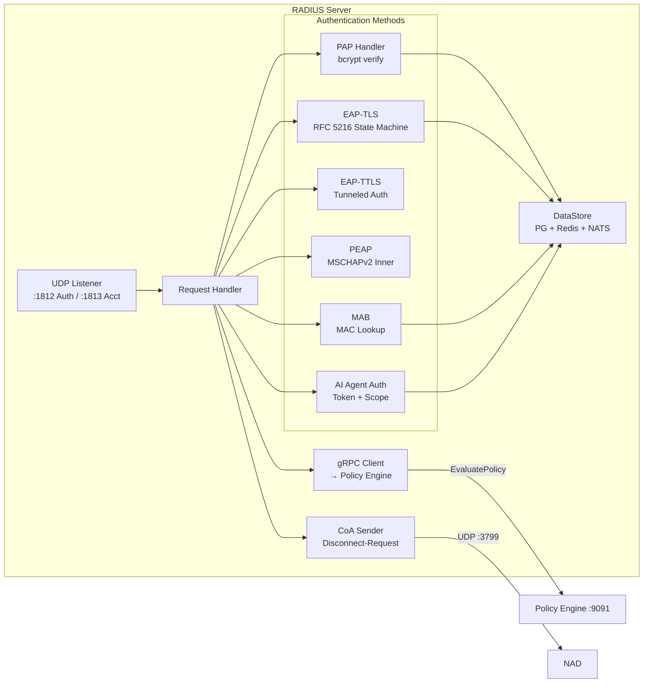

**Key files:**
- `cmd/server/main.go` — Entry point, listener setup, health endpoint
- `internal/handler/handler.go` — Request dispatch, EAP state machines, auth result building
- `internal/store/store.go` — PostgreSQL, Redis, NATS connections + data queries
- `internal/radius/server.go` — UDP packet I/O, RADIUS protocol decode/encode
- `internal/coa/coa.go` — CoA Disconnect-Request sender
- `internal/radsec/radsec.go` — RADIUS over TLS listener
- `internal/tacacs/tacacs.go` — TACACS+ protocol handler

### 2.2 API Gateway (Python FastAPI)

The API Gateway is the central REST API serving 22 routers through a layered middleware stack.

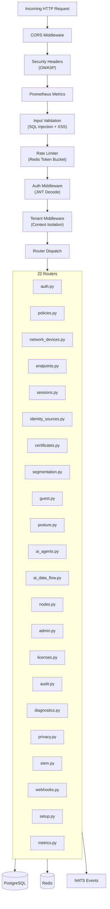

### 2.3 Policy Engine

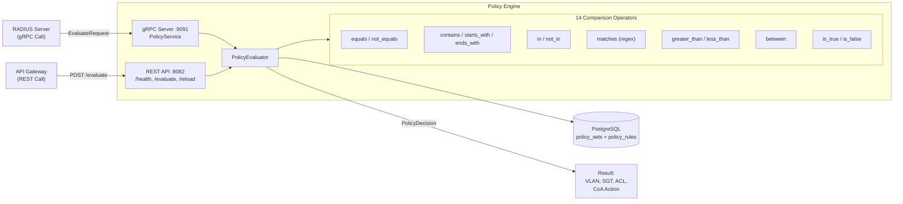

### 2.4 AI Engine — 7 Module Architecture

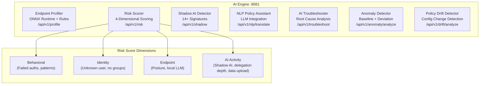

### 2.5 Sync Engine — Twin-Node Replication

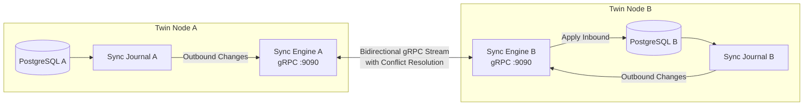

**Sync workflow:**
1. Any DB write creates a journal entry with table name, row ID, operation, and timestamp
2. Sync engine polls journal for undelivered entries
3. Entries are streamed to peer via bidirectional gRPC
4. Peer applies changes with last-writer-wins conflict resolution
5. Health endpoint reports sync lag, pending entries, and peer connection state

---

## 3. Data Flow Diagrams

### 3.1 802.1X Authentication Flow (EAP-TLS)

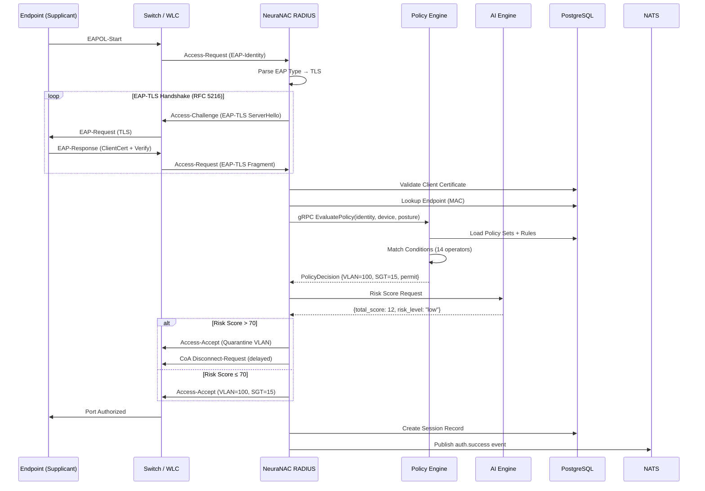

### 3.2 PAP Authentication Flow

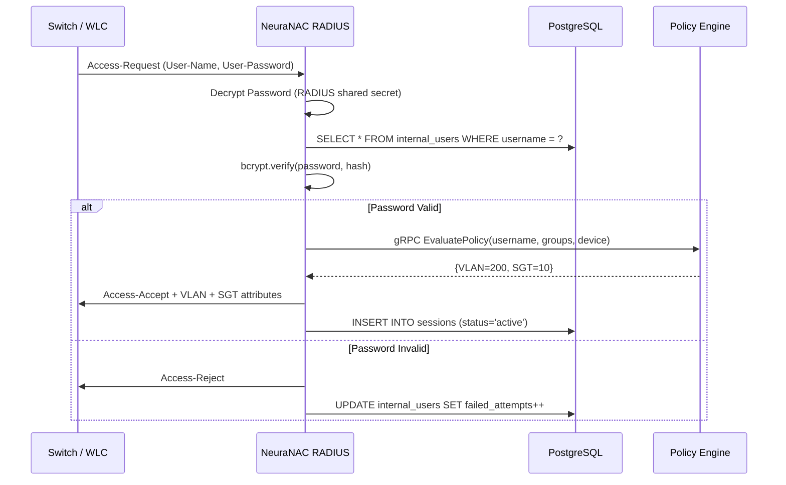

### 3.3 AI Agent Authentication Flow

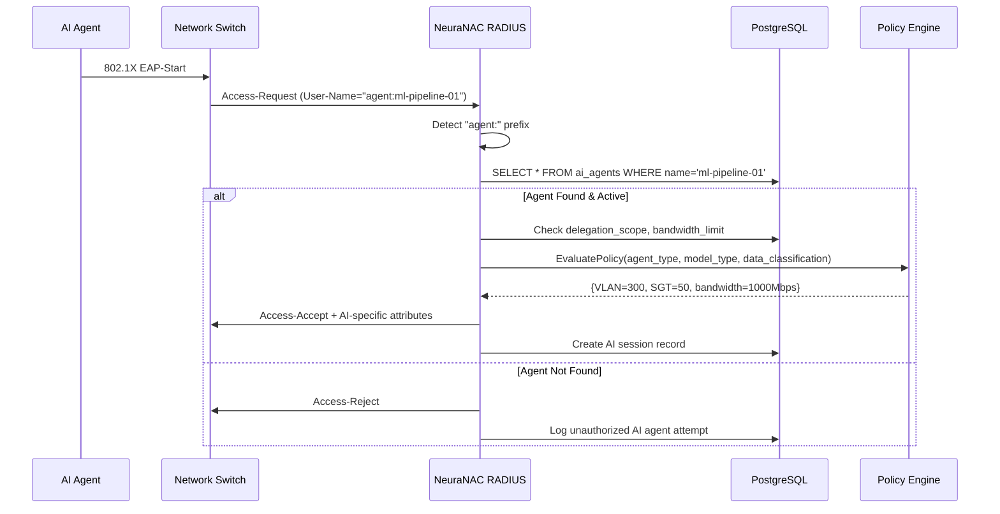

### 3.4 Guest Portal Flow

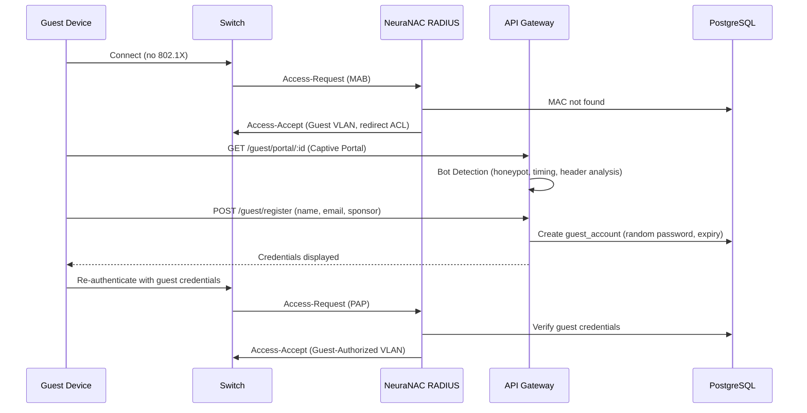

### 3.5 Posture Assessment Flow

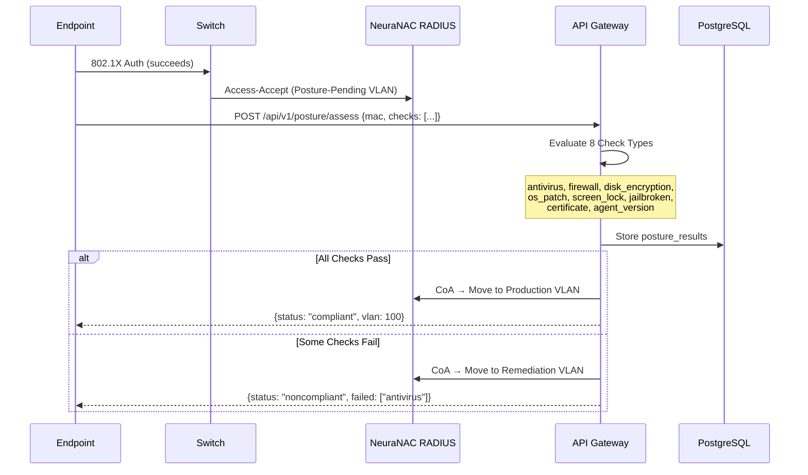

### 3.6 SIEM Integration Flow

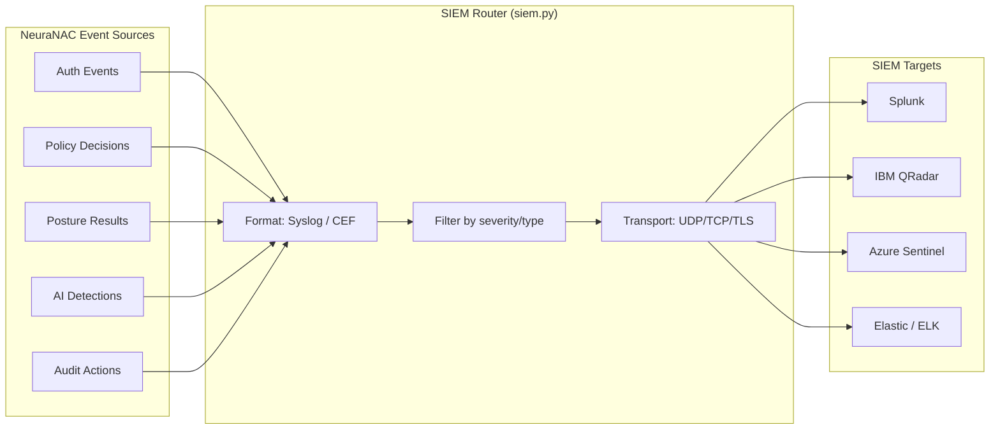

---

## 4. Integration Architecture

### 4.1 Identity Source Integration

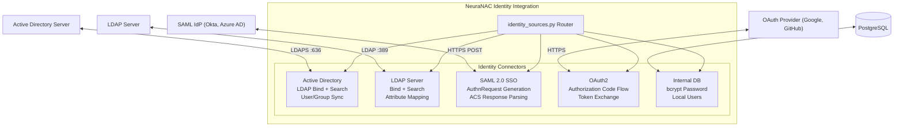

### 4.2 NAD Integration Matrix

| Vendor        | Device Types                        | RADIUS | TACACS+ | RadSec | CoA | MAB | 802.1X | SNMPv3 |
| ------------- | ----------------------------------- | ------ | ------- | ------ | --- | --- | ------ | ------ |
| **Cisco**     | Catalyst, Nexus, WLC, ASA, ISR      | ✅     | ✅      | ✅     | ✅  | ✅  | ✅     | ✅     |
| **Aruba/HPE** | CX, Instant AP, Mobility Controller | ✅     | ✅      | ✅     | ✅  | ✅  | ✅     | ✅     |
| **Juniper**   | EX, QFX, SRX, Mist AP               | ✅     | ✅      | ✅     | ✅  | ✅  | ✅     | ✅     |
| **Fortinet**  | FortiSwitch, FortiGate, FortiAP     | ✅     | ❌      | ❌     | ✅  | ✅  | ✅     | ✅     |
| **Palo Alto** | PA Series (VPN/Firewall)            | ✅     | ✅      | ❌     | ✅  | ❌  | ✅     | ❌     |
| **Meraki**    | MS Switches, MR APs                 | ✅     | ❌      | ❌     | ✅  | ✅  | ✅     | ❌     |
| **Ruckus**    | ICX, SmartZone, Unleashed           | ✅     | ❌      | ❌     | ✅  | ✅  | ✅     | ✅     |
| **Dell**      | PowerSwitch (OS10)                  | ✅     | ✅      | ❌     | ✅  | ✅  | ✅     | ✅     |
| **Generic**   | Any RADIUS-compliant device         | ✅     | —       | —      | ⚠️ | ✅  | ✅     | —      |

> ⚠️ CoA support varies by vendor implementation. NeuraNAC sends standard RFC 5176 Disconnect-Request.

### 4.3 Event Bus (NATS JetStream) Topics

| Subject               | Publisher     | Subscribers             | Payload                               |
| --------------------- | ------------- | ----------------------- | ------------------------------------- |
| `neuranac.auth.success`    | RADIUS Server | API GW, AI Engine, SIEM | Session ID, username, NAS-IP, VLAN    |
| `neuranac.auth.failure`    | RADIUS Server | API GW, AI Engine, SIEM | Username, NAS-IP, reason              |
| `neuranac.auth.accounting` | RADIUS Server | API GW                  | Session ID, acct-type, bytes in/out   |
| `neuranac.policy.decision` | Policy Engine | API GW, SIEM            | Policy ID, result, attributes         |
| `neuranac.ai.risk`         | AI Engine     | RADIUS Server, API GW   | Endpoint MAC, risk score, level       |
| `neuranac.ai.shadow`       | AI Engine     | API GW, SIEM            | Detection details, service name       |
| `neuranac.posture.result`  | API Gateway   | RADIUS Server           | Endpoint MAC, compliance status       |
| `neuranac.coa.trigger`     | API Gateway   | RADIUS Server           | NAS-IP, session ID, action            |
| `neuranac.sync.change`     | Sync Engine   | Peer Sync Engine        | Table, row ID, operation, data        |
| `neuranac.audit.action`    | API Gateway   | SIEM                    | Admin user, action, resource, details |

---

## 5. Database Schema Design

### 5.1 Schema Overview

NeuraNAC uses a single PostgreSQL 16 database with **45+ tables** organized into functional domains:

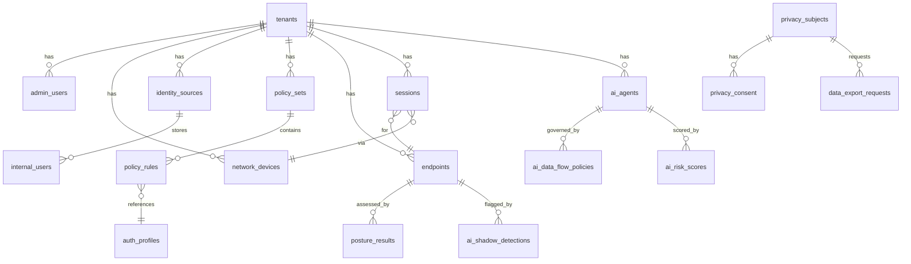

### 5.2 Table Domains

| Domain             | Tables                                                  | Key Purpose                              |
| ------------------ | ------------------------------------------------------- | ---------------------------------------- |
| **Core**           | `tenants`, `admin_roles`, `admin_users`, `audit_logs`   | Multi-tenancy, RBAC, audit trail         |
| **Licensing**      | `licenses`, `feature_flags`                             | License management, feature toggles      |
| **Network**        | `network_devices`                                       | NAD inventory (IP, vendor, secret, CoA)  |
| **Identity**       | `identity_sources`, `internal_users`, `user_groups`     | Identity providers, local users, groups  |
| **Certificates**   | `certificate_authorities`, `certificates`               | X.509 CA hierarchy, expiry tracking      |
| **Endpoints**      | `endpoints`, `endpoint_profiles`                        | Device inventory, AI-generated profiles  |
| **Policy**         | `policy_sets`, `policy_rules`, `auth_profiles`          | Policy evaluation rules, result profiles |
| **Segmentation**   | `security_group_tags`, `sgacls`, `policy_matrix`        | TrustSec SGTs, ACLs, adaptive matrix     |
| **Sessions**       | `sessions`, `accounting_records`                        | Active/historical RADIUS sessions        |
| **Guest/BYOD**     | `guest_portals`, `guest_accounts`, `byod_registrations` | Guest lifecycle, BYOD cert provisioning  |
| **Posture**        | `posture_policies`, `posture_results`                   | Compliance checks, assessment results    |
| **Sync**           | `sync_journal`, `sync_state`                            | Change tracking, replication state       |
| **AI**             | `ai_agents`, `ai_data_flow_policies`, `ai_risk_scores`  | AI governance, risk scores, shadow AI    |
| **Data Retention** | `data_retention_policies`                               | Automated data lifecycle management      |
| **Privacy**        | `privacy_subjects`, `privacy_consent`, `data_exports`   | GDPR/CCPA compliance                     |

---

## 6. Security Architecture

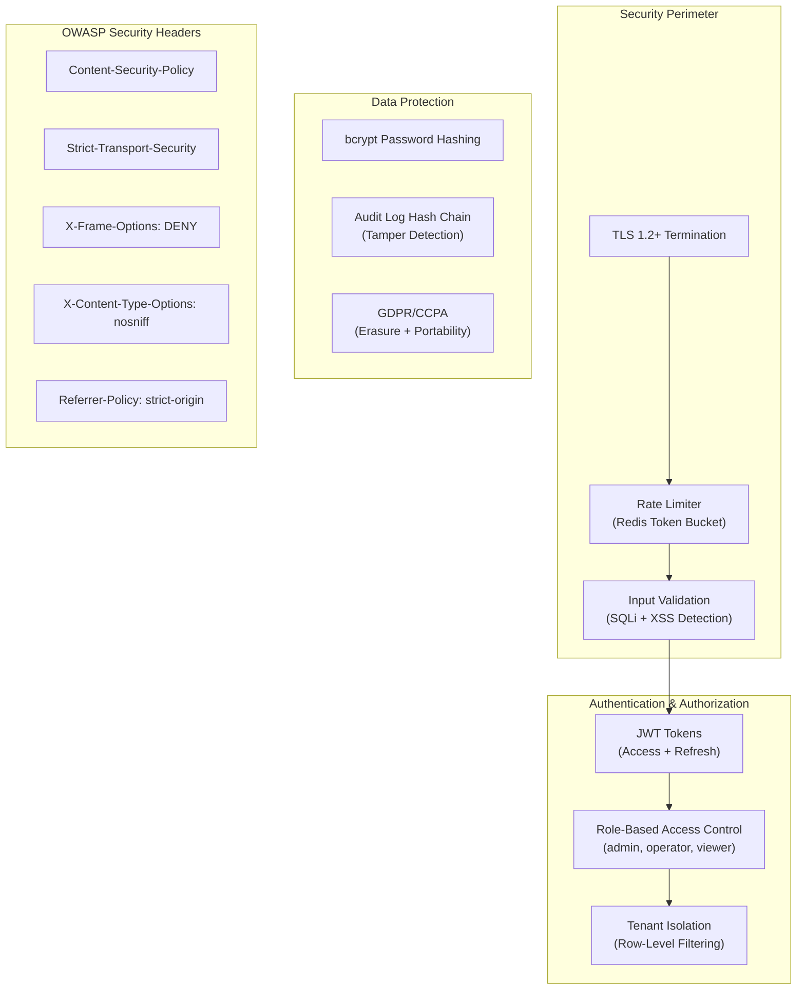

**Middleware stack order (applied to every request):**
1. CORS — Cross-origin resource sharing
2. Security Headers — OWASP recommended headers
3. Prometheus Metrics — Request counting and latency
4. Input Validation — SQL injection, XSS pattern detection, body size limits
5. Rate Limiter — Per-IP token bucket (configurable)
6. JWT Authentication — Token decode, user context extraction
7. Tenant Isolation — Tenant ID from JWT injected into DB queries

---

## 7. Deployment Architecture

### 7.1 Development (Docker Compose)

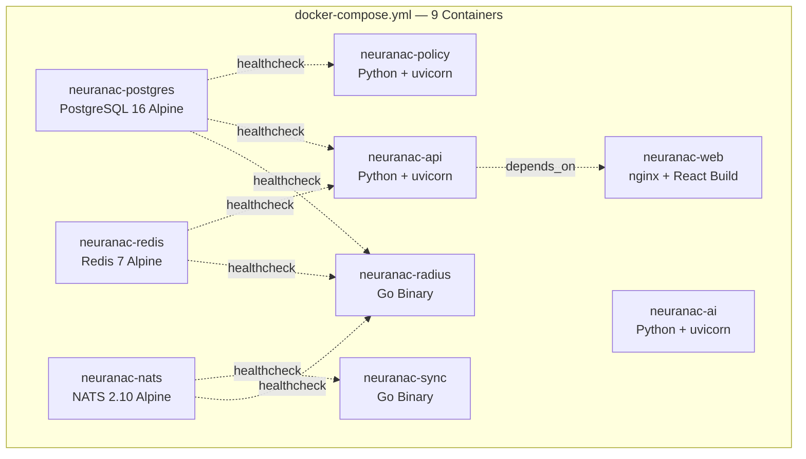

### 7.2 Production (Kubernetes + Helm)

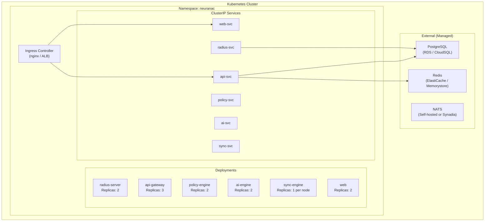

### 7.3 On-Premises Twin-Node HA

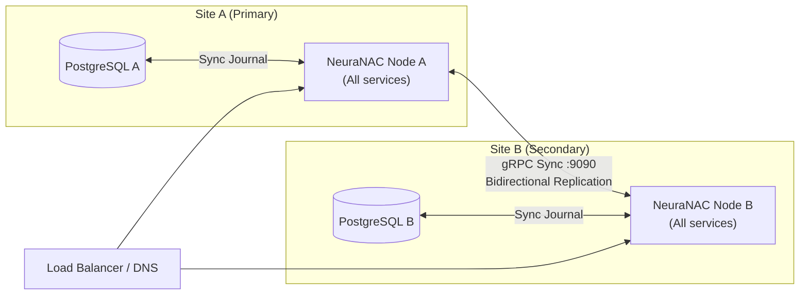

---

## 8. Network Topology

### Typical Enterprise Deployment

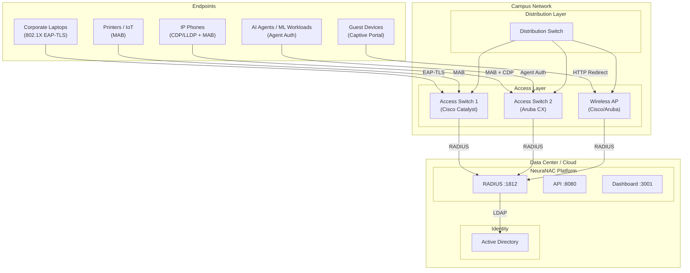

---

## 9. Legacy NAC Integration Architecture

NeuraNAC can operate alongside Legacy NAC 3.4+ via API-based synchronization. This is **not** a node-level join — NeuraNAC connects to NeuraNAC's public APIs (ERS, Event Stream, MnT) to share context and enable migration.

### 9.1 NeuraNAC Coexistence Topology

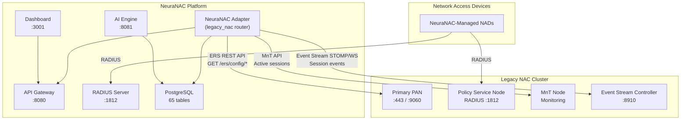

### 9.2 Legacy Sync Data Flow

```mermaid
sequenceDiagram
    participant ADMIN as NeuraNAC Admin
    participant API as API Gateway
    participant NeuraNAC as NeuraNAC PPAN
    participant DB as PostgreSQL

    ADMIN->>API: POST /api/v1/legacy-nac/connections (hostname, creds)
    API->>DB: INSERT legacy_nac_connections
    API->>DB: INSERT legacy_nac_sync_state (6 entity types)
    API-->>ADMIN: Connection created

    ADMIN->>API: POST /api/v1/legacy-nac/connections/{id}/test
    API->>NeuraNAC: GET /ers/config/networkdevice?size=1
    NeuraNAC-->>API: 200 OK
    API->>DB: UPDATE connection_status = 'connected'
    API-->>ADMIN: Connected

    ADMIN->>API: POST /api/v1/legacy-nac/connections/{id}/sync
    API->>DB: INSERT legacy_nac_sync_log (status=started)
    
    loop For each entity type
        API->>NeuraNAC: GET /ers/config/{type}?page=N&size=100
        NeuraNAC-->>API: {SearchResult: {resources: [...]}}
        API->>DB: UPSERT into NeuraNAC tables
        API->>DB: UPSERT legacy_nac_entity_map (legacy_nac_id → neuranac_id)
        API->>DB: UPDATE legacy_nac_sync_state (items_synced)
    end
    
    API->>DB: UPDATE legacy_nac_sync_log (status=success)
    API-->>ADMIN: Sync complete (316 entities)
```

### 9.3 NeuraNAC Entity Mapping

| Legacy ERS Endpoint                   | NeuraNAC Target Table         | Sync Direction | Key Fields              |
| ---------------------------------- | ------------------------ | -------------- | ----------------------- |
| `/ers/config/networkdevice`        | `network_devices`        | NeuraNAC → NeuraNAC      | IP, name, RADIUS config |
| `/ers/config/internaluser`         | `admin_users`            | NeuraNAC → NeuraNAC      | username, group         |
| `/ers/config/endpoint`             | `endpoints`              | NeuraNAC → NeuraNAC      | MAC, profile            |
| `/ers/config/identitygroup`        | `identity_sources`       | NeuraNAC → NeuraNAC      | name, parent            |
| `/ers/config/sgt`                  | `security_group_tags`    | NeuraNAC → NeuraNAC      | name, value             |
| `/ers/config/authorizationprofile` | `authorization_profiles` | NeuraNAC → NeuraNAC      | VLAN, DACL, SGT         |

### 9.4 Database Tables (Legacy NAC Integration)

```mermaid
erDiagram
    legacy_nac_connections {
        UUID id PK
        UUID tenant_id FK
        VARCHAR hostname
        INT ers_port
        BOOLEAN event-stream_enabled
        VARCHAR deployment_mode
        VARCHAR connection_status
    }

    legacy_nac_sync_state {
        UUID id PK
        UUID connection_id FK
        VARCHAR entity_type
        VARCHAR last_sync_status
        INT items_synced
        INT items_total
    }

    legacy_nac_sync_log {
        UUID id PK
        UUID connection_id FK
        VARCHAR sync_type
        VARCHAR status
        INT items_created
        INT duration_ms
    }

    legacy_nac_entity_map {
        UUID id PK
        UUID connection_id FK
        VARCHAR entity_type
        VARCHAR legacy_nac_id
        UUID neuranac_id
        VARCHAR sync_hash
    }

    legacy_nac_connections ||--o{ legacy_nac_sync_state : "has sync state"
    legacy_nac_connections ||--o{ legacy_nac_sync_log : "has sync logs"
    legacy_nac_connections ||--o{ legacy_nac_entity_map : "has entity mappings"
```

> **Full design document:** See [NeuraNAC_INTEGRATION.md](NeuraNAC_INTEGRATION.md) for the complete technical design, migration runbook, Event Stream integration details, and FAQ for tech leads.
