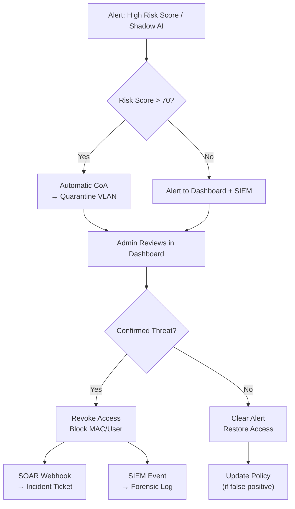

# NeuraNAC Workflows & Configuration Guide

This document provides end-to-end workflow guides for all major NeuraNAC operations, supported NAD devices, and step-by-step configuration procedures.

---

## Table of Contents

1. [Supported Network Access Devices (NADs)](#1-supported-network-access-devices)
2. [NAD Configuration — End to End](#2-nad-configuration--end-to-end)
3. [802.1X Authentication Workflows](#3-8021x-authentication-workflows)
4. [Guest Access Workflow](#4-guest-access-workflow)
5. [BYOD Onboarding Workflow](#5-byod-onboarding-workflow)
6. [AI Agent Onboarding Workflow](#6-ai-agent-onboarding-workflow)
7. [Policy Creation Workflow](#7-policy-creation-workflow)
8. [Posture Assessment Workflow](#8-posture-assessment-workflow)
9. [Identity Source Configuration](#9-identity-source-configuration)
10. [Certificate Management Workflow](#10-certificate-management-workflow)
11. [Network Segmentation Workflow](#11-network-segmentation-workflow)
12. [SIEM Integration Workflow](#12-siem-integration-workflow)
13. [Twin-Node HA Setup Workflow](#13-twin-node-ha-setup-workflow)
14. [Shadow AI Monitoring Workflow](#14-shadow-ai-monitoring-workflow)
15. [Incident Response Workflow](#15-incident-response-workflow)
16. [Day-2 Operations Workflows](#16-day-2-operations-workflows)
17. [Legacy NAC Integration Workflow](#17-legacy-nac-integration-workflow)

---

## 1. Supported Network Access Devices

### 1.1 Full Compatibility Matrix

| Vendor             | Models                          | RADIUS Auth | RADIUS Acct | TACACS+ | RadSec | CoA | MAB | 802.1X | VLAN Assign | SGT/TrustSec |
| ------------------ | ------------------------------- | ----------- | ----------- | ------- | ------ | --- | --- | ------ | ----------- | ------------ |
| **Cisco**          | Catalyst 9000, 3000, 2960       | ✅          | ✅          | ✅      | ✅     | ✅  | ✅  | ✅     | ✅          | ✅           |
| **Cisco**          | Nexus 9000, 7000, 5000          | ✅          | ✅          | ✅      | ❌     | ✅  | ✅  | ✅     | ✅          | ✅           |
| **Cisco**          | WLC 9800, 5520, 3504            | ✅          | ✅          | ❌      | ✅     | ✅  | ✅  | ✅     | ✅          | ✅           |
| **Cisco**          | ASA 5500-X, Firepower           | ✅          | ✅          | ✅      | ❌     | ✅  | ❌  | ✅     | ✅          | ❌           |
| **Cisco**          | ISR 4000, ASR 1000              | ✅          | ✅          | ✅      | ✅     | ✅  | ✅  | ✅     | ✅          | ✅           |
| **Cisco**          | Meraki MS, MR, MX               | ✅          | ✅          | ❌      | ❌     | ✅  | ✅  | ✅     | ✅          | ❌           |
| **Aruba/HPE**      | CX 6000, 8000                   | ✅          | ✅          | ✅      | ✅     | ✅  | ✅  | ✅     | ✅          | ❌           |
| **Aruba/HPE**      | Instant AP, Mobility Controller | ✅          | ✅          | ❌      | ✅     | ✅  | ✅  | ✅     | ✅          | ❌           |
| **Juniper**        | EX2300, EX3400, EX4300          | ✅          | ✅          | ✅      | ✅     | ✅  | ✅  | ✅     | ✅          | ❌           |
| **Juniper**        | QFX5100, QFX5200                | ✅          | ✅          | ✅      | ✅     | ✅  | ✅  | ✅     | ✅          | ❌           |
| **Juniper**        | SRX300, SRX1500                 | ✅          | ✅          | ✅      | ❌     | ✅  | ❌  | ✅     | ✅          | ❌           |
| **Juniper**        | Mist AP                         | ✅          | ✅          | ❌      | ❌     | ✅  | ✅  | ✅     | ✅          | ❌           |
| **Fortinet**       | FortiSwitch                     | ✅          | ✅          | ❌      | ❌     | ✅  | ✅  | ✅     | ✅          | ❌           |
| **Fortinet**       | FortiGate                       | ✅          | ✅          | ❌      | ❌     | ✅  | ❌  | ✅     | ✅          | ❌           |
| **Fortinet**       | FortiAP                         | ✅          | ✅          | ❌      | ❌     | ✅  | ✅  | ✅     | ✅          | ❌           |
| **Palo Alto**      | PA-220 to PA-7000               | ✅          | ✅          | ✅      | ❌     | ✅  | ❌  | ✅     | ✅          | ❌           |
| **Ruckus**         | ICX 7150, 7650                  | ✅          | ✅          | ❌      | ❌     | ✅  | ✅  | ✅     | ✅          | ❌           |
| **Ruckus**         | SmartZone, Unleashed            | ✅          | ✅          | ❌      | ❌     | ✅  | ✅  | ✅     | ✅          | ❌           |
| **Dell**           | PowerSwitch S/N/Z Series        | ✅          | ✅          | ✅      | ❌     | ✅  | ✅  | ✅     | ✅          | ❌           |
| **Extreme**        | X435, X440-G2, X465             | ✅          | ✅          | ❌      | ❌     | ✅  | ✅  | ✅     | ✅          | ❌           |
| **Allied Telesis** | x530, x930                      | ✅          | ✅          | ❌      | ❌     | ✅  | ✅  | ✅     | ✅          | ❌           |

### 1.2 Protocol Requirements

| Protocol    | Standard  | Port | Transport   | Purpose                           |
| ----------- | --------- | ---- | ----------- | --------------------------------- |
| RADIUS Auth | RFC 2865  | 1812 | UDP         | Authentication (PAP, EAP, MAB)    |
| RADIUS Acct | RFC 2866  | 1813 | UDP         | Accounting (start, interim, stop) |
| RADIUS CoA  | RFC 5176  | 3799 | UDP         | Change of Authorization           |
| RadSec      | RFC 6614  | 2083 | TCP/TLS     | RADIUS over TLS                   |
| TACACS+     | RFC 8907  | 49   | TCP         | Device administration             |
| EAP-TLS     | RFC 5216  | —    | Over RADIUS | Certificate-based auth            |
| EAP-TTLS    | RFC 5281  | —    | Over RADIUS | Tunneled auth                     |
| PEAP        | Microsoft | —    | Over RADIUS | Protected EAP                     |

---

## 2. NAD Configuration — End to End

### 2.1 Prerequisites

Before adding a NAD to NeuraNAC:
- [ ] NAD has IP connectivity to NeuraNAC RADIUS server
- [ ] NAD supports RADIUS (port 1812/1813 UDP)
- [ ] A shared secret is agreed upon (minimum 16 characters recommended)
- [ ] Network VLANs are pre-configured on the NAD
- [ ] 802.1X is enabled on target switch ports (if using EAP)

### 2.2 Step 1: Register the NAD in NeuraNAC

**Via Dashboard:**
1. Login to NeuraNAC Dashboard (http://localhost:3001)
2. Navigate to **Network Devices** in the sidebar
3. Click **Add Device**
4. Fill in the form:
   - **Name:** `access-switch-01`
   - **IP Address:** `10.10.1.1`
   - **Device Type:** `switch`
   - **Vendor:** `cisco`
   - **Model:** `Catalyst 9300`
   - **Shared Secret:** `MyStr0ngS3cret!`
   - **RADIUS CoA Port:** `3799`
   - **RadSec Enabled:** No (default)
5. Click **Save**

**Via API:**
```bash
curl -X POST http://localhost:8080/api/v1/network-devices/ \
  -H "Authorization: Bearer $TOKEN" \
  -H "Content-Type: application/json" \
  -d '{
    "name": "access-switch-01",
    "ip_address": "10.10.1.1",
    "device_type": "switch",
    "vendor": "cisco",
    "model": "Catalyst 9300",
    "shared_secret": "MyStr0ngS3cret!",
    "coa_port": 3799,
    "radsec_enabled": false,
    "location": "Building A, Floor 2, IDF-2A"
  }'
```

### 2.3 Step 2: Configure the NAD to Point to NeuraNAC

**Cisco Catalyst (IOS-XE):**
```
! AAA configuration
aaa new-model
aaa authentication dot1x default group radius
aaa authorization network default group radius
aaa accounting dot1x default start-stop group radius

! RADIUS server
radius server NeuraNAC-PRIMARY
 address ipv4 <NeuraNAC_IP> auth-port 1812 acct-port 1813
 key MyStr0ngS3cret!

! CoA
aaa server radius dynamic-author
 client <NeuraNAC_IP> server-key MyStr0ngS3cret!
 port 3799

! 802.1X global
dot1x system-auth-control

! Interface configuration
interface GigabitEthernet1/0/1
 switchport mode access
 switchport access vlan 100
 authentication port-control auto
 dot1x pae authenticator
 mab
 authentication order dot1x mab
 authentication priority dot1x mab
```

**Aruba CX (AOS-CX):**
```
! RADIUS server
radius-server host <NeuraNAC_IP> key plaintext MyStr0ngS3cret!
radius-server host <NeuraNAC_IP> auth-port 1812
radius-server host <NeuraNAC_IP> acct-port 1813

! AAA
aaa authentication port-access dot1x authenticator
  radius server-group NeuraNAC
aaa authentication port-access mac-auth
  radius server-group NeuraNAC

! Port configuration
interface 1/1/1
  aaa authentication port-access dot1x authenticator
  aaa authentication port-access mac-auth
  aaa authentication port-access auth-priority dot1x mac-auth
  aaa authentication port-access client-limit 32
```

**Juniper EX (Junos):**
```
set access radius-server <NeuraNAC_IP> secret MyStr0ngS3cret!
set access radius-server <NeuraNAC_IP> port 1812
set access radius-server <NeuraNAC_IP> accounting-port 1813

set protocols dot1x authenticator interface ge-0/0/1
set protocols dot1x authenticator interface ge-0/0/1 mac-radius
set protocols dot1x authenticator interface ge-0/0/1 retries 3
```

### 2.4 Step 3: Create Authentication Policy

1. Navigate to **Policies** in the dashboard
2. Click **Create Policy Set**
3. Configure:
   - **Name:** `Wired-Access-Policy`
   - **Condition:** `NAS-IP-Address equals 10.10.1.1`
   - **Auth Profile:** Select or create profile with VLAN/SGT settings
4. Add policy rules:
   - Rule 1: `User-Group contains "employees"` → VLAN 100, SGT 10
   - Rule 2: `User-Group contains "contractors"` → VLAN 200, SGT 20
   - Rule 3: `Endpoint-Profile equals "printer"` → VLAN 300, SGT 30 (MAB)
   - Default: → VLAN 999 (quarantine)

### 2.5 Step 4: Test Authentication

```bash
# Test PAP authentication
radtest testuser testing123 <NeuraNAC_IP> 0 MyStr0ngS3cret!

# Expected output:
# Received Access-Accept Id 123 from <NeuraNAC_IP>:1812 to ...:0 length 44
#   Tunnel-Type:0 = VLAN
#   Tunnel-Medium-Type:0 = IEEE-802
#   Tunnel-Private-Group-Id:0 = "100"

# Verify session was created
curl http://localhost:8080/api/v1/sessions/ \
  -H "Authorization: Bearer $TOKEN"
```

### 2.6 Step 5: Enable Auto-Discovery (Optional)

For large deployments, use auto-discovery to find NADs on a subnet:

```bash
curl -X POST http://localhost:8080/api/v1/network-devices/discover \
  -H "Authorization: Bearer $TOKEN" \
  -H "Content-Type: application/json" \
  -d '{"subnet": "10.10.1.0/24"}'
```

This will:
1. Scan the subnet for live hosts
2. Probe ports: RADIUS (1812), SNMP (161), SSH (22), HTTP (80/443)
3. Guess vendor from MAC OUI prefix
4. Return a list of discovered devices for review and import

### 2.7 Step 6: Verify & Monitor

- **Dashboard → Sessions** — Confirm endpoints are authenticating
- **Dashboard → Audit Log** — Review admin and auth events
- **Dashboard → Diagnostics** — Run connectivity test to the NAD
- **API:** `curl http://localhost:8080/api/v1/diagnostics/connectivity-test -d '{"host":"10.10.1.1","port":22}'`

---

## 3. 802.1X Authentication Workflows

### 3.1 EAP-TLS (Certificate-Based)

**Use case:** Corporate laptops with machine certificates

**Prerequisites:**
- Client certificate deployed to endpoints (via MDM or GPO)
- CA certificate imported into NeuraNAC (Dashboard → Certificates → Import CA)
- EAP-TLS enabled in policy

**Flow:**
```
Endpoint → Switch → NeuraNAC RADIUS
  1. EAPOL-Start
  2. EAP-Identity Request/Response
  3. EAP-TLS ServerHello (NeuraNAC sends its cert)
  4. EAP-TLS ClientCert (Endpoint sends its cert)
  5. NeuraNAC validates cert against stored CA
  6. NeuraNAC evaluates policy (identity + device + posture)
  7. Access-Accept with VLAN/SGT attributes
```

**NAD Config (Cisco):**
```
interface GigabitEthernet1/0/1
 authentication order dot1x
 dot1x pae authenticator
```

### 3.2 EAP-TTLS (Tunneled)

**Use case:** BYOD devices with username/password in secure tunnel

**Flow:**
```
Endpoint → Switch → NeuraNAC RADIUS
  1. Outer TLS tunnel established (server cert only)
  2. Inner PAP or MSCHAPv2 auth within tunnel
  3. Username/password verified against identity source
  4. Policy evaluated → VLAN/SGT assigned
```

### 3.3 PEAP (Protected EAP)

**Use case:** Windows domain machines using MSCHAPv2

**Flow:**
```
Endpoint → Switch → NeuraNAC RADIUS
  1. PEAP outer TLS tunnel (server cert only)
  2. MSCHAPv2 inner exchange
  3. Domain credentials verified (AD/LDAP)
  4. Policy evaluated → VLAN/SGT assigned
```

### 3.4 MAB (MAC Authentication Bypass)

**Use case:** Headless devices (printers, IP phones, IoT)

**Flow:**
```
Device → Switch → NeuraNAC RADIUS
  1. Switch sends MAC address as username
  2. NeuraNAC looks up MAC in endpoints table
  3. AI Profiler classifies device type
  4. Policy evaluated based on device profile
  5. Access-Accept with appropriate VLAN
```

**NAD Config (Cisco):**
```
interface GigabitEthernet1/0/10
 authentication order mab
 mab
 switchport access vlan 300
```

### 3.5 PAP (Password Authentication Protocol)

**Use case:** Legacy devices, VPN concentrators

**Flow:**
```
Device → VPN/NAD → NeuraNAC RADIUS
  1. Access-Request with User-Name + User-Password
  2. NeuraNAC decrypts password using shared secret
  3. bcrypt verify against internal_users table
  4. Policy evaluated → Access-Accept or Reject
```

---

## 4. Guest Access Workflow

### Step 1: Create Guest Portal
```
Dashboard → Guest & BYOD → Create Portal
  - Name: "Visitor WiFi"
  - Fields: name, email, company, phone
  - Terms & conditions: enabled
  - Self-registration: enabled
  - Sponsor approval: optional
  - Account expiry: 24 hours
```

### Step 2: Configure Redirect Policy
```
Policy: If no-802.1X AND no-MAB-match → Guest VLAN + Redirect ACL
  VLAN: 999 (guest-redirect)
  ACL: permit DNS, permit DHCP, redirect HTTP to portal
```

### Step 3: Guest Connects
```
1. Guest device connects to network (wireless/wired)
2. MAB fails (unknown MAC) → assigned to Guest VLAN
3. HTTP redirect to captive portal URL
4. Guest fills registration form
5. Bot detection validates (honeypot, timing, headers)
6. Guest account created with random password + expiry
7. Guest re-authenticates with new credentials
8. PAP auth succeeds → moved to authorized Guest VLAN
```

### Step 4: Sponsor Approval (Optional)
```
1. Guest submits registration
2. Email sent to sponsor for approval
3. Sponsor approves via link
4. Guest account activated
5. Guest notified via email/SMS
```

---

## 5. BYOD Onboarding Workflow

```
1. User connects personal device to BYOD SSID
2. MAB → unknown MAC → Onboarding VLAN
3. Redirect to BYOD registration portal
4. User authenticates with corporate credentials
5. Device type detected (OS, platform)
6. Certificate provisioned to device
7. Device profile created in NeuraNAC
8. Re-authentication with provisioned cert (EAP-TLS)
9. Policy assigns appropriate VLAN based on device + user
```

---

## 6. AI Agent Onboarding Workflow

### Step 1: Register AI Agent
```bash
curl -X POST http://localhost:8080/api/v1/ai/agents \
  -H "Authorization: Bearer $TOKEN" \
  -H "Content-Type: application/json" \
  -d '{
    "name": "ml-pipeline-01",
    "type": "ml_training",
    "delegation_scope": "data-analytics",
    "model_type": "transformer",
    "runtime": "pytorch",
    "auth_method": "certificate",
    "bandwidth_limit_mbps": 1000,
    "data_classification": ["internal", "confidential"]
  }'
```

### Step 2: Configure Data Flow Policy
```bash
curl -X POST http://localhost:8080/api/v1/ai/data-flow/policies \
  -H "Authorization: Bearer $TOKEN" \
  -H "Content-Type: application/json" \
  -d '{
    "name": "ML Training Data Policy",
    "agent_types": ["ml_training"],
    "allowed_destinations": ["data-lake.internal", "gpu-cluster.internal"],
    "blocked_destinations": ["*.openai.com", "*.anthropic.com"],
    "max_data_egress_gb": 100,
    "require_encryption": true
  }'
```

### Step 3: Agent Authenticates
```
1. AI agent connects to network
2. RADIUS detects "agent:" prefix in username
3. Agent looked up in ai_agents table
4. Delegation scope and bandwidth checked
5. Policy evaluated with AI-specific conditions
6. Access-Accept with AI VLAN + bandwidth limit
7. Shadow AI detector monitors ongoing traffic
```

---

## 7. Policy Creation Workflow

### 7.1 Via Dashboard

```
1. Navigate to Policies
2. Click "Create Policy Set"
3. Enter name and description
4. Set priority (lower = higher priority)
5. Add conditions:
   - Attribute: e.g., "User-Group"
   - Operator: e.g., "contains"
   - Value: e.g., "employees"
6. Configure result:
   - VLAN ID: 100
   - SGT Value: 10
   - ACL: "permit-all"
   - Session Timeout: 28800 (8 hours)
7. Save and test
```

### 7.2 Via NLP (Natural Language)

```bash
# Use AI-powered natural language policy creation
curl -X POST http://localhost:8081/api/v1/nlp/translate \
  -H "Content-Type: application/json" \
  -d '{"text": "Allow employees to access VLAN 100 with SGT 10 during business hours"}'

# Response:
{
  "policy_rule": {
    "conditions": [
      {"attribute": "User-Group", "operator": "contains", "value": "employees"},
      {"attribute": "Time-Of-Day", "operator": "between", "value": "08:00-18:00"}
    ],
    "result": {
      "vlan_id": 100,
      "sgt_value": 10,
      "action": "permit"
    }
  }
}
```

### 7.3 Available Policy Operators

| Operator       | Example                            | Description        |
| -------------- | ---------------------------------- | ------------------ |
| `equals`       | `username equals "admin"`          | Exact match        |
| `not_equals`   | `device_type not_equals "printer"` | Not equal          |
| `contains`     | `user_groups contains "employees"` | Substring match    |
| `starts_with`  | `mac starts_with "AA:BB"`          | Prefix match       |
| `ends_with`    | `hostname ends_with ".corp"`       | Suffix match       |
| `in`           | `vlan in [100, 200, 300]`          | Value in list      |
| `not_in`       | `location not_in ["guest", "dmz"]` | Value not in list  |
| `matches`      | `hostname matches "^srv-[0-9]+$"`  | Regex match        |
| `greater_than` | `risk_score greater_than 70`       | Numeric comparison |
| `less_than`    | `failed_auths less_than 5`         | Numeric comparison |
| `between`      | `time between "08:00-18:00"`       | Range check        |
| `is_true`      | `posture_compliant is_true`        | Boolean true       |
| `is_false`     | `is_guest is_false`                | Boolean false      |

---

## 8. Posture Assessment Workflow

### Step 1: Define Posture Policy

```bash
curl -X POST http://localhost:8080/api/v1/posture/policies \
  -H "Authorization: Bearer $TOKEN" \
  -H "Content-Type: application/json" \
  -d '{
    "name": "Corporate Laptop Compliance",
    "checks": [
      {"type": "antivirus", "required": true, "params": {"min_version": "2024.1"}},
      {"type": "firewall", "required": true},
      {"type": "disk_encryption", "required": true},
      {"type": "os_patch", "required": true, "params": {"max_days_old": 30}},
      {"type": "screen_lock", "required": true, "params": {"max_timeout_minutes": 5}},
      {"type": "jailbroken", "required": true},
      {"type": "certificate", "required": false},
      {"type": "agent_version", "required": true, "params": {"min_version": "3.0.0"}}
    ],
    "remediation_vlan": 999,
    "compliant_vlan": 100
  }'
```

### Step 2: Endpoint Assessment

```
1. Endpoint authenticates successfully (802.1X)
2. Assigned to posture-pending VLAN
3. Posture agent on endpoint reports status
4. NeuraNAC evaluates all 8 check types
5. Results stored in posture_results table
6. If compliant → CoA moves to production VLAN
7. If non-compliant → CoA moves to remediation VLAN
8. Remediation instructions displayed to user
```

---

## 9. Identity Source Configuration

### 9.1 Active Directory

```bash
curl -X POST http://localhost:8080/api/v1/identity-sources/ \
  -H "Authorization: Bearer $TOKEN" \
  -H "Content-Type: application/json" \
  -d '{
    "name": "Corporate AD",
    "type": "active_directory",
    "config": {
      "host": "ad.corp.example.com",
      "port": 636,
      "use_ssl": true,
      "base_dn": "DC=corp,DC=example,DC=com",
      "bind_dn": "CN=neuranac-service,OU=Service Accounts,DC=corp,DC=example,DC=com",
      "bind_password": "ServiceAccountPassword",
      "user_search_base": "OU=Users,DC=corp,DC=example,DC=com",
      "group_search_base": "OU=Groups,DC=corp,DC=example,DC=com"
    }
  }'

# Test connection
curl -X POST http://localhost:8080/api/v1/identity-sources/{id}/test

# Sync users and groups
curl -X POST http://localhost:8080/api/v1/identity-sources/{id}/sync
```

### 9.2 SAML SSO

```bash
curl -X POST http://localhost:8080/api/v1/identity-sources/ \
  -H "Authorization: Bearer $TOKEN" \
  -H "Content-Type: application/json" \
  -d '{
    "name": "Okta SSO",
    "type": "saml",
    "config": {
      "entity_id": "https://neuranac.example.com/saml",
      "sso_url": "https://company.okta.com/app/neuranac/sso/saml",
      "slo_url": "https://company.okta.com/app/neuranac/slo/saml",
      "certificate": "<IdP signing certificate PEM>",
      "name_id_format": "emailAddress",
      "attribute_mapping": {
        "email": "user.email",
        "groups": "user.groups",
        "display_name": "user.displayName"
      }
    }
  }'

# Initiate SAML login
# GET /api/v1/identity-sources/{id}/saml/login → Redirects to IdP
# POST /api/v1/identity-sources/{id}/saml/acs → ACS callback
```

### 9.3 OAuth2

```bash
curl -X POST http://localhost:8080/api/v1/identity-sources/ \
  -H "Authorization: Bearer $TOKEN" \
  -H "Content-Type: application/json" \
  -d '{
    "name": "Google Workspace",
    "type": "oauth2",
    "config": {
      "client_id": "xxx.apps.googleusercontent.com",
      "client_secret": "GOCSPX-xxx",
      "authorization_url": "https://accounts.google.com/o/oauth2/v2/auth",
      "token_url": "https://oauth2.googleapis.com/token",
      "userinfo_url": "https://www.googleapis.com/oauth2/v3/userinfo",
      "scopes": ["openid", "email", "profile"],
      "redirect_uri": "https://neuranac.example.com/api/v1/identity-sources/oauth/callback"
    }
  }'
```

---

## 10. Certificate Management Workflow

### Create a Certificate Authority

```bash
curl -X POST http://localhost:8080/api/v1/certificates/cas \
  -H "Authorization: Bearer $TOKEN" \
  -H "Content-Type: application/json" \
  -d '{
    "common_name": "NeuraNAC Root CA",
    "organization": "Example Corp",
    "country": "US",
    "validity_years": 10,
    "key_type": "RSA",
    "key_size": 4096
  }'
```

### Generate Server Certificate (for RadSec)

```bash
curl -X POST http://localhost:8080/api/v1/certificates/generate \
  -H "Authorization: Bearer $TOKEN" \
  -H "Content-Type: application/json" \
  -d '{
    "ca_id": "<ca-uuid>",
    "subject": "CN=radius.neuranac.example.com",
    "usage": "server",
    "validity_days": 365,
    "san": ["radius.neuranac.example.com", "10.10.1.100"]
  }'
```

### Generate Client Certificate (for EAP-TLS)

```bash
curl -X POST http://localhost:8080/api/v1/certificates/generate \
  -H "Authorization: Bearer $TOKEN" \
  -H "Content-Type: application/json" \
  -d '{
    "ca_id": "<ca-uuid>",
    "subject": "CN=laptop-001.corp.example.com",
    "usage": "client",
    "validity_days": 365
  }'
```

### Monitor Expiring Certificates

```bash
# List certificates expiring within 30 days
curl "http://localhost:8080/api/v1/certificates/?expiring_within_days=30" \
  -H "Authorization: Bearer $TOKEN"
```

---

## 11. Network Segmentation Workflow

### Create Security Group Tags

```bash
# Create SGTs
curl -X POST http://localhost:8080/api/v1/segmentation/sgts \
  -H "Authorization: Bearer $TOKEN" -H "Content-Type: application/json" \
  -d '{"name": "Employees", "tag_value": 10, "description": "Corporate employees"}'

curl -X POST http://localhost:8080/api/v1/segmentation/sgts \
  -H "Authorization: Bearer $TOKEN" -H "Content-Type: application/json" \
  -d '{"name": "Contractors", "tag_value": 20, "description": "External contractors"}'

curl -X POST http://localhost:8080/api/v1/segmentation/sgts \
  -H "Authorization: Bearer $TOKEN" -H "Content-Type: application/json" \
  -d '{"name": "IoT Devices", "tag_value": 30, "description": "Printers, cameras, sensors"}'

curl -X POST http://localhost:8080/api/v1/segmentation/sgts \
  -H "Authorization: Bearer $TOKEN" -H "Content-Type: application/json" \
  -d '{"name": "AI Agents", "tag_value": 50, "description": "ML/AI workloads"}'
```

### Define Policy Matrix

```bash
# View current matrix
curl http://localhost:8080/api/v1/segmentation/matrix \
  -H "Authorization: Bearer $TOKEN"

# The matrix shows SGT-to-SGT permission mappings:
# Employees(10) → IoT(30): permit
# Contractors(20) → IoT(30): deny
# AI Agents(50) → Employees(10): deny
# AI Agents(50) → AI Agents(50): permit (peer communication)
```

---

## 12. SIEM Integration Workflow

### Configure SIEM Target

```bash
curl -X POST http://localhost:8080/api/v1/siem/targets \
  -H "Authorization: Bearer $TOKEN" \
  -H "Content-Type: application/json" \
  -d '{
    "name": "Splunk SIEM",
    "host": "splunk.corp.example.com",
    "port": 514,
    "protocol": "tcp",
    "format": "cef",
    "enabled": true,
    "event_types": ["auth.success", "auth.failure", "policy.decision", "ai.shadow_detected", "posture.noncompliant"],
    "severity_filter": "warning"
  }'

# Test connectivity
curl -X POST http://localhost:8080/api/v1/siem/targets/{id}/test \
  -H "Authorization: Bearer $TOKEN"
```

### CEF Event Format Example

```
CEF:0|NeuraNAC|NeuraNAC|1.0|auth.failure|Authentication Failed|7|
  src=10.20.30.40 suser=jdoe msg=Invalid password
  cs1=access-switch-01 cs1Label=NAS-Name
  cs2=PAP cs2Label=Auth-Method
  cn1=3 cn1Label=Failed-Attempt-Count
```

---

## 13. Twin-Node HA Setup Workflow

### Step 1: Deploy Node A (Primary)

```bash
# Helm install with node A config
helm install neuranac-a helm/neuranac -f helm/neuranac/values-onprem.yaml \
  --set global.nodeId=twin-a \
  --set syncEngine.peerAddress="" \
  --namespace neuranac --create-namespace
```

### Step 2: Deploy Node B (Secondary)

```bash
# Helm install with node B config, pointing to A
helm install neuranac-b helm/neuranac -f helm/neuranac/values-onprem.yaml \
  --set global.nodeId=twin-b \
  --set syncEngine.peerAddress=neuranac-a-sync:9090 \
  --namespace neuranac
```

### Step 3: Configure Node A to Peer with B

```bash
helm upgrade neuranac-a helm/neuranac -f helm/neuranac/values-onprem.yaml \
  --set global.nodeId=twin-a \
  --set syncEngine.peerAddress=neuranac-b-sync:9090
```

### Step 4: Verify Sync

```bash
# Check sync status on both nodes
curl http://node-a:9100/sync/status
curl http://node-b:9100/sync/status

# Expected: peer_connected=true, pending_outbound=0
```

### Step 5: Configure DNS / Load Balancer

- Active-Active: DNS round-robin or L4 load balancer
- Active-Passive: DNS failover or floating VIP
- RADIUS: Both nodes should be configured as servers on each NAD (primary + secondary)

---

## 14. Shadow AI Monitoring Workflow

### Enable Shadow AI Detection

```
1. Dashboard → AI Data Flow → Policies
2. Create data flow policy
3. Define approved AI services
4. Define blocked AI services
5. Set alerting thresholds
```

### Detection Signatures (14+ Built-in)

| Service                  | Detection Method      | Risk Level        |
| ------------------------ | --------------------- | ----------------- |
| OpenAI (ChatGPT, API)    | DNS + HTTP headers    | High              |
| Anthropic (Claude)       | DNS + TLS SNI         | High              |
| Google AI (Gemini, PaLM) | DNS patterns          | High              |
| Hugging Face             | DNS + API patterns    | Medium            |
| Cohere                   | DNS + HTTP headers    | Medium            |
| Stability AI             | DNS patterns          | Medium            |
| Midjourney               | DNS + WebSocket       | Medium            |
| GitHub Copilot           | DNS + HTTP headers    | Low (if approved) |
| Amazon Bedrock           | DNS + AWS headers     | Medium            |
| Azure OpenAI             | DNS + Azure headers   | Medium            |
| Replicate                | DNS + API patterns    | Medium            |
| Ollama (Local)           | Port scanning (11434) | Low               |
| LM Studio (Local)        | Port scanning (1234)  | Low               |
| LocalAI                  | Port scanning (8080)  | Low               |

### Response Actions

1. **Alert** — Log detection, notify admin via dashboard + SIEM
2. **Quarantine** — CoA to move endpoint to restricted VLAN
3. **Block** — Add firewall rule via SOAR webhook integration
4. **Investigate** — AI Troubleshooter provides root-cause analysis

---

## 15. Incident Response Workflow

### Compromised Endpoint Response



### Steps:
1. **Detection** — AI Engine flags high risk score or shadow AI
2. **Containment** — Automatic CoA moves endpoint to quarantine VLAN
3. **Investigation** — Admin reviews in Dashboard → Diagnostics → AI Troubleshooter
4. **Remediation** — Block MAC/user, update policy, trigger SOAR playbook
5. **Recovery** — Clear alert, restore access after remediation verified
6. **Lessons Learned** — Update posture policies, adjust risk thresholds

---

## 16. Day-2 Operations Workflows

### 16.1 Add a New VLAN to the Network

1. Configure VLAN on switches
2. Update NeuraNAC policy rules with new VLAN
3. Create/update auth profiles with VLAN assignment
4. Test with a known endpoint

### 16.2 Onboard a New Building / Floor

1. Register new NADs (switches, APs) in NeuraNAC
2. Assign to existing or new policy sets (by NAS-IP range)
3. Verify 802.1X connectivity
4. Monitor Sessions dashboard for successful auths

### 16.3 Rotate RADIUS Shared Secrets

1. Generate new shared secret
2. Update NeuraNAC: Dashboard → Network Devices → Edit → Shared Secret
3. Update NAD configuration simultaneously
4. Test authentication immediately after change
5. Monitor for auth failures in Audit Log

### 16.4 Certificate Renewal

1. Dashboard → Certificates → Filter by expiring in 30 days
2. Generate new certificate with same subject
3. Deploy to endpoint/server
4. Revoke old certificate
5. Verify EAP-TLS authentication still works

### 16.5 Policy Drift Check

```bash
# Use AI Engine to detect policy drift
curl -X POST http://localhost:8081/api/v1/drift/analyze \
  -H "Content-Type: application/json" \
  -d '{"baseline_date": "2026-01-01", "current_date": "2026-02-20"}'
```

### 16.6 Database Maintenance

```bash
# Check database size
docker exec neuranac-postgres psql -U neuranac -c "SELECT pg_size_pretty(pg_database_size('neuranac'))"

# Vacuum and analyze
docker exec neuranac-postgres psql -U neuranac -c "VACUUM ANALYZE"

# Check active sessions count
docker exec neuranac-postgres psql -U neuranac -c "SELECT count(*) FROM sessions WHERE is_active"

# Purge old sessions (older than 90 days)
docker exec neuranac-postgres psql -U neuranac -c "DELETE FROM sessions WHERE ended_at < NOW() - INTERVAL '90 days'"
```

---

## 17. Legacy NAC Integration Workflow

### Overview

NeuraNAC supports three deployment models for customers with or without an existing Legacy NAC:

| Model           | Customer Profile         | NeuraNAC Role                                                |
| --------------- | ------------------------ | ------------------------------------------------------- |
| **Standalone**  | No NeuraNAC                   | NeuraNAC is the sole NAC platform                            |
| **Coexistence** | NeuraNAC 3.4+ in production   | NeuraNAC runs alongside NeuraNAC, syncs data via ERS API + Event Stream |
| **Migration**   | NeuraNAC planned decommission | 5-phase cutover from Legacy NAC to NeuraNAC                         |

### 17.1 Prerequisites

- Legacy NAC version **3.4 or later**
- **ERS API enabled** on NeuraNAC: Administration → Settings → API Settings → Enable ERS
- NeuraNAC admin account with ERS Read (and optionally Write) permissions
- Network connectivity from NeuraNAC to NeuraNAC on ports **443** and **9060**
- (Optional) Event Stream enabled on NeuraNAC, NeuraNAC client certificate approved

### 17.2 Step 1 — Add Legacy Connection

**Via Dashboard:**
1. Navigate to **Legacy NAC Integration** in the sidebar
2. Click **"Add Legacy Connection"**
3. Fill in:
   - **Name:** `NeuraNAC Primary PAN`
   - **Hostname:** `legacy-nac.example.com`
   - **Username:** ERS admin username
   - **Password:** ERS admin password
   - **ERS Port:** `9060` (default)
   - **Deployment Mode:** `Coexistence` or `Migration`
4. Click **Create Connection**

**Via API:**
```bash
curl -X POST http://localhost:8080/api/v1/legacy-nac/connections \
  -H "Authorization: Bearer $TOKEN" \
  -H "Content-Type: application/json" \
  -d '{
    "name": "NeuraNAC Primary PAN",
    "hostname": "legacy-nac.example.com",
    "port": 443,
    "username": "ers-admin",
    "password": "your-password",
    "ers_enabled": true,
    "ers_port": 9060,
    "event_stream_enabled": false,
    "verify_ssl": true,
    "deployment_mode": "coexistence"
  }'
```

### 17.3 Step 2 — Test Connection

```bash
# Test ERS API connectivity
curl -X POST http://localhost:8080/api/v1/legacy-nac/connections/{conn_id}/test \
  -H "Authorization: Bearer $TOKEN"

# Expected response:
# {"status": "connected", "http_status": 200}
```

### 17.4 Step 3 — Preview NeuraNAC Data

Before syncing, preview what data exists on NeuraNAC:

```bash
# Preview network devices
curl http://localhost:8080/api/v1/legacy-nac/connections/{conn_id}/preview/network_device \
  -H "Authorization: Bearer $TOKEN"

# Preview endpoints
curl http://localhost:8080/api/v1/legacy-nac/connections/{conn_id}/preview/endpoint \
  -H "Authorization: Bearer $TOKEN"

# Preview SGTs
curl http://localhost:8080/api/v1/legacy-nac/connections/{conn_id}/preview/sgt \
  -H "Authorization: Bearer $TOKEN"
```

### 17.5 Step 4 — Full Sync

```bash
# Trigger full sync of all entity types
curl -X POST http://localhost:8080/api/v1/legacy-nac/connections/{conn_id}/sync \
  -H "Authorization: Bearer $TOKEN" \
  -H "Content-Type: application/json" \
  -d '{
    "entity_types": ["all"],
    "sync_type": "full",
    "direction": "legacy_to_neuranac"
  }'

# Expected response:
# {"sync_id": "...", "status": "completed", "total_synced": 316, "results": [...]}
```

### 17.6 Step 5 — Check Sync Status

```bash
# Per-entity sync status
curl http://localhost:8080/api/v1/legacy-nac/connections/{conn_id}/sync-status \
  -H "Authorization: Bearer $TOKEN"

# Sync history log
curl http://localhost:8080/api/v1/legacy-nac/connections/{conn_id}/sync-log \
  -H "Authorization: Bearer $TOKEN"

# Entity ID mapping (NeuraNAC ↔ NeuraNAC)
curl http://localhost:8080/api/v1/legacy-nac/connections/{conn_id}/entity-map \
  -H "Authorization: Bearer $TOKEN"
```

### 17.7 Migration Workflow (NeuraNAC → NeuraNAC)

If the goal is to replace NeuraNAC entirely:

**Phase 1 — Sync (Week 1-2):**
```bash
# Set mode to migration
curl -X POST http://localhost:8080/api/v1/legacy-nac/connections/{conn_id}/migration \
  -H "Authorization: Bearer $TOKEN" \
  -d '{"action": "start_migration"}'
```

**Phase 2 — Validate (Week 3-4):**
- Compare entity counts: NeuraNAC admin portal vs NeuraNAC dashboard
- Spot-check 10 NADs, 10 endpoints, all SGTs
- Run NeuraNAC AI risk assessment on synced data

**Phase 3 — Pilot NADs (Week 5-8):**
```
! On pilot switches (non-critical), change RADIUS server to NeuraNAC:

radius server NeuraNAC-PRIMARY
  address ipv4 <neuranac-ip> auth-port 1812 acct-port 1813
  key <shared-secret>

aaa group server radius NeuraNAC-GROUP
  server name NeuraNAC-PRIMARY
```

**Phase 4 — Full Cutover (Week 9-12):**
- Move remaining NADs batch by batch (by floor/building)
- Monitor auth success rate (target > 99.5%)

**Phase 5 — Decommission NeuraNAC (Week 13+):**
```bash
# Mark migration complete
curl -X POST http://localhost:8080/api/v1/legacy-nac/connections/{conn_id}/migration \
  -H "Authorization: Bearer $TOKEN" \
  -d '{"action": "complete_migration"}'

# legacy connection set to readonly — safe to decommission NeuraNAC after validation
```

**Rollback at any point:**
```bash
curl -X POST http://localhost:8080/api/v1/legacy-nac/connections/{conn_id}/migration \
  -H "Authorization: Bearer $TOKEN" \
  -d '{"action": "rollback"}'
# Reverts to coexistence mode. Move NADs back to NeuraNAC RADIUS.
```

### 17.8 Legacy NAC Integration API Reference

| Method | Endpoint                                        | Description              |
| ------ | ----------------------------------------------- | ------------------------ |
| GET    | `/api/v1/legacy-nac/connections`                       | List all legacy connections |
| POST   | `/api/v1/legacy-nac/connections`                       | Create new connection    |
| GET    | `/api/v1/legacy-nac/connections/{id}`                  | Connection details       |
| PUT    | `/api/v1/legacy-nac/connections/{id}`                  | Update connection        |
| DELETE | `/api/v1/legacy-nac/connections/{id}`                  | Remove connection        |
| POST   | `/api/v1/legacy-nac/connections/{id}/test`             | Test ERS connectivity    |
| GET    | `/api/v1/legacy-nac/connections/{id}/sync-status`      | Sync status per entity   |
| POST   | `/api/v1/legacy-nac/connections/{id}/sync`             | Trigger sync             |
| GET    | `/api/v1/legacy-nac/connections/{id}/sync-log`         | Sync history             |
| GET    | `/api/v1/legacy-nac/connections/{id}/entity-map`       | NeuraNAC ↔ NeuraNAC ID mapping     |
| GET    | `/api/v1/legacy-nac/connections/{id}/migration-status` | Migration progress       |
| POST   | `/api/v1/legacy-nac/connections/{id}/migration`        | Execute migration action |
| GET    | `/api/v1/legacy-nac/connections/{id}/preview/{type}`   | Preview NeuraNAC entities     |
| GET    | `/api/v1/legacy-nac/summary`                           | Dashboard summary        |

> **Full design document:** See [NeuraNAC_INTEGRATION.md](NeuraNAC_INTEGRATION.md) for the complete technical design, architecture decisions, Event Stream integration, security considerations, and FAQ for tech leads.
